# Technical Architecture Document
# Learning Management System (LMS) Platform

**Document Version:** 1.0  
**Classification:** Internal Technical  
**Last Updated:** February 19, 2026  
**Author:** Engineering Architecture Team  
**Reviewers:** TBD  

---

## Document Control

| Version | Date | Author | Changes |
|---------|------|--------|---------|
| 0.1 | 2026-02-05 | Architecture Team | Initial draft |
| 0.5 | 2026-02-12 | Architecture Team | Added data models, API specs |
| 1.0 | 2026-02-19 | Architecture Team | Final review version |

---

## Table of Contents

1. [Executive Summary](#1-executive-summary)
2. [Architecture Principles](#2-architecture-principles)
3. [System Overview](#3-system-overview)
4. [High-Level Architecture](#4-high-level-architecture)
5. [Technology Stack](#5-technology-stack)
6. [Microservices Architecture](#6-microservices-architecture)
7. [Data Architecture](#7-data-architecture)
8. [API Design](#8-api-design)
9. [Security Architecture](#9-security-architecture)
10. [Scalability & Performance](#10-scalability--performance)
11. [Infrastructure & Deployment](#11-infrastructure--deployment)
12. [Observability](#12-observability)
13. [Disaster Recovery](#13-disaster-recovery)
14. [Cost Estimation](#14-cost-estimation)
15. [Appendices](#15-appendices)

---

## 1. Executive Summary

### 1.1 Architecture Vision

This document defines the technical architecture for **LearnHub LMS**, a cloud-native, microservices-based Learning Management System designed for scale, security, and rapid innovation. The architecture supports:

- **10M+ concurrent learners** across global regions
- **99.95% availability** SLA
- **Sub-200ms API latency** at P95
- **Multi-tenant isolation** with shared infrastructure efficiency
- **AI/ML integration** for personalized learning experiences

### 1.2 Key Architectural Decisions

| Decision | Rationale |
|----------|-----------|
| **Microservices** | Independent scaling, team autonomy, technology diversity |
| **Event-Driven** | Loose coupling, resilience, real-time capabilities |
| **Cloud-Native** | Elasticity, managed services, global reach |
| **API-First** | Integration ecosystem, mobile support, partner access |
| **Multi-Region** | Low latency, disaster recovery, data sovereignty |

### 1.3 Architecture Constraints

| Constraint | Impact |
|------------|--------|
| **GDPR Compliance** | Data residency, right to deletion, consent management |
| **FERPA Compliance** | Educational record protection, access controls |
| **SOC 2 Requirements** | Audit logging, access controls, encryption |
| **WCAG 2.1 AA** | Accessibility requirements affect frontend architecture |
| **Budget** | Initial infrastructure budget: $50K/month at launch |

---

## 2. Architecture Principles

### 2.1 Design Principles

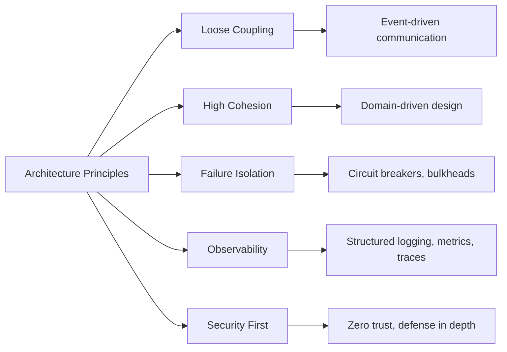

### 2.2 Guiding Principles

| Principle | Description |
|-----------|-------------|
| **You Build It, You Run It** | Teams own services end-to-end including on-call |
| **Automate Everything** | CI/CD, infrastructure as code, automated testing |
| **Design for Failure** | Assume components fail; build resilience |
| **Secure by Default** | Security is built-in, not bolted on |
| **Measure Everything** | If you can't measure it, you can't improve it |
| **API-First** | Design APIs before implementation |
| **Data Ownership** | Services own their data; no shared databases |
| **Backward Compatibility** | APIs are versioned; never break clients |

### 2.3 Anti-Patterns to Avoid

| Anti-Pattern | Why Avoid | Alternative |
|--------------|-----------|-------------|
| **Distributed Monolith** | Tight coupling defeats microservices benefits | Event-driven, clear boundaries |
| **Shared Database** | Creates coupling, limits independent scaling | Database per service |
| **Synchronous Chaining** | Latency accumulation, cascade failures | Async events, circuit breakers |
| **God Services** | Hard to understand, test, scale | Single responsibility |
| **Magic Infrastructure** | Undocumented, unrepeatable | Infrastructure as Code |

---

## 3. System Overview

### 3.1 System Context

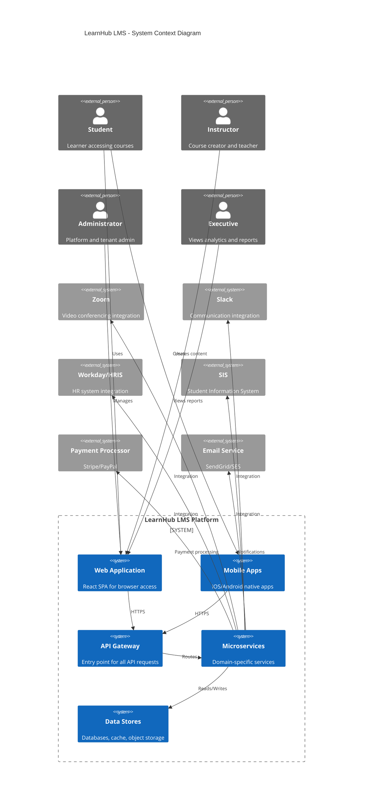

### 3.2 Logical Architecture

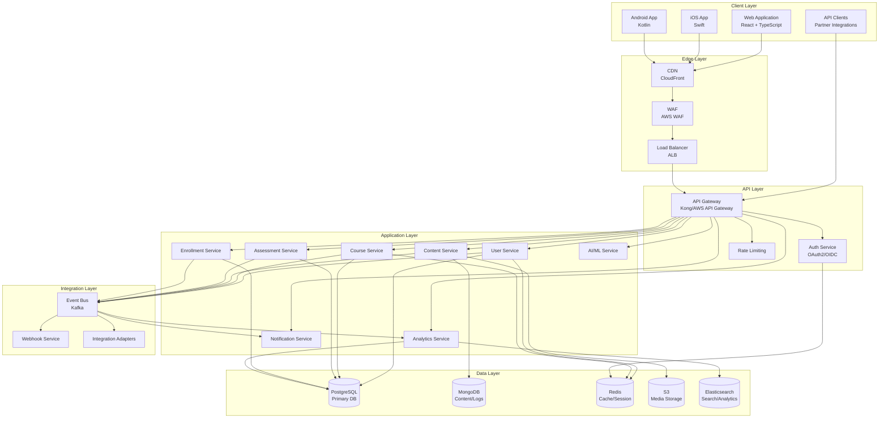

---

## 4. High-Level Architecture

### 4.1 Deployment Architecture

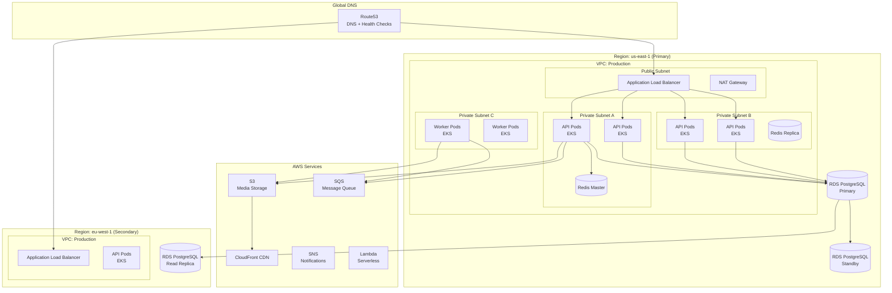

### 4.2 Data Flow Architecture

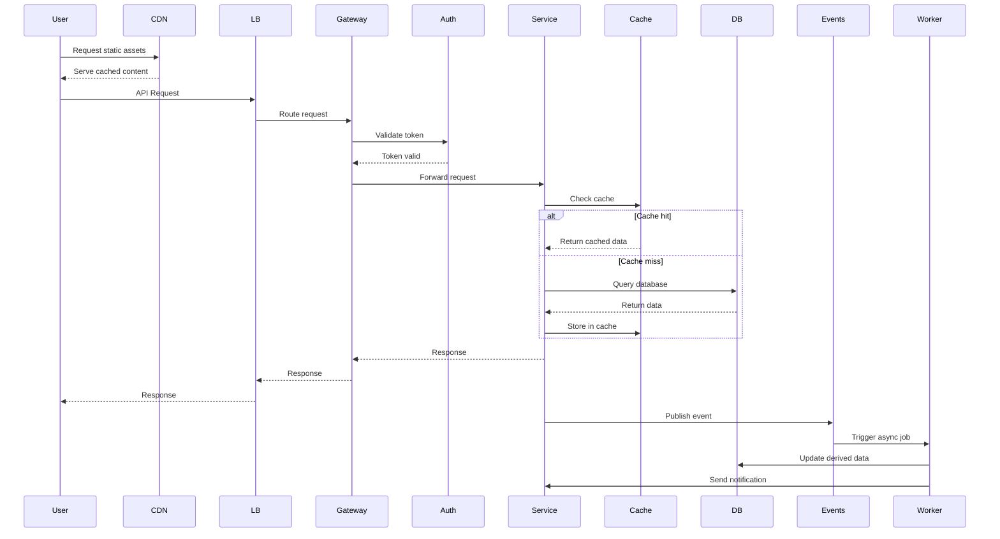

### 4.3 Multi-Tenancy Architecture

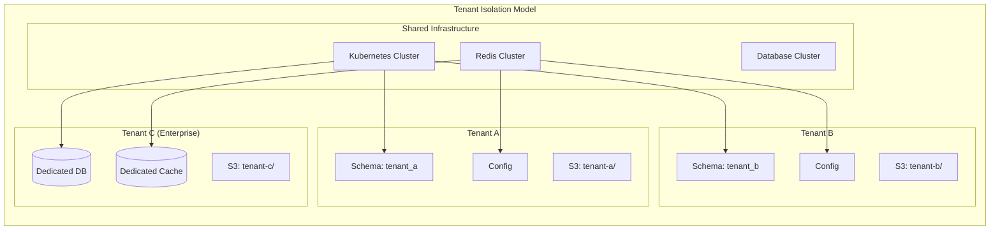

---

## 5. Technology Stack

### 5.1 Technology Selection Criteria

| Criterion | Weight | Description |
|-----------|--------|-------------|
| **Scalability** | 25% | Ability to handle growth |
| **Team Expertise** | 20% | Existing skills and hiring market |
| **Ecosystem** | 20% | Libraries, tools, community |
| **Operational Maturity** | 15% | Monitoring, debugging, deployment |
| **Cost** | 10% | Licensing and operational costs |
| **Security** | 10% | Security track record and features |

### 5.2 Backend Technologies

| Component | Technology | Rationale |
|-----------|------------|-----------|
| **Primary Language** | Go (Golang) | Performance, concurrency, simplicity |
| **Secondary Language** | Python | AI/ML services, data processing |
| **API Framework** | Gin (Go), FastAPI (Python) | Performance, OpenAPI support |
| **gRPC** | gRPC-Go | Internal service communication |
| **Database (Primary)** | PostgreSQL 15 | ACID compliance, JSONB, extensions |
| **Database (NoSQL)** | MongoDB 7 | Flexible schemas, content storage |
| **Cache** | Redis 7 | Sessions, caching, pub/sub |
| **Search** | Elasticsearch 8 | Full-text search, analytics |
| **Message Queue** | Apache Kafka | Event streaming, durability |
| **Object Storage** | AWS S3 | Media storage, durability |

### 5.3 Frontend Technologies

| Component | Technology | Rationale |
|-----------|------------|-----------|
| **Web Framework** | React 18 | Ecosystem, performance, hiring |
| **Language** | TypeScript 5 | Type safety, developer experience |
| **State Management** | Zustand | Simplicity, performance |
| **UI Components** | Custom + Radix UI | Accessibility, customization |
| **Styling** | Tailwind CSS | Developer experience, performance |
| **Build Tool** | Vite | Fast builds, HMR |
| **Testing** | Vitest, Playwright | Fast unit tests, E2E testing |
| **Mobile** | React Native | Code sharing, native performance |

### 5.4 Infrastructure Technologies

| Component | Technology | Rationale |
|-----------|------------|-----------|
| **Cloud Provider** | AWS | Market leader, service breadth |
| **Container Orchestration** | Kubernetes (EKS) | Industry standard, portability |
| **Infrastructure as Code** | Terraform | Multi-cloud, state management |
| **CI/CD** | GitHub Actions | Integration, ease of use |
| **Service Mesh** | Istio | Traffic management, observability |
| **API Gateway** | Kong | Performance, plugins |
| **Secrets Management** | AWS Secrets Manager + Vault | Security, rotation |
| **Configuration** | AWS AppConfig | Feature flags, dynamic config |

### 5.5 Observability Stack

| Component | Technology | Purpose |
|-----------|------------|---------|
| **Metrics** | Prometheus + Grafana | System and business metrics |
| **Logging** | Loki + Grafana | Aggregated log management |
| **Tracing** | Jaeger/Tempo | Distributed tracing |
| **Alerting** | Grafana Alerting + PagerDuty | Incident management |
| **Dashboards** | Grafana | Unified observability UI |
| **Error Tracking** | Sentry | Application error monitoring |

### 5.6 AI/ML Stack

| Component | Technology | Purpose |
|-----------|------------|---------|
| **ML Platform** | AWS SageMaker | Model training, deployment |
| **Feature Store** | Feast | Feature management |
| **Vector Database** | Pinecone | Embedding storage, similarity search |
| **LLM Integration** | Anthropic Claude API | AI features |
| **ML Pipelines** | Kubeflow | ML workflow orchestration |

---

## 6. Microservices Architecture

### 6.1 Service Decomposition

```mermaid
flowchart TB
    subgraph "Core Services"
        auth_svc[Auth Service<br/>Authentication, Authorization]
        user_svc[User Service<br/>User management, profiles]
        tenant_svc[Tenant Service<br/>Multi-tenancy, billing]
    end
    
    subgraph "Learning Services"
        course_svc[Course Service<br/>Course CRUD, structure]
        content_svc[Content Service<br/>Media, SCORM, xAPI]
        enrollment_svc[Enrollment Service<br/>Enrollments, progress]
        assessment_svc[Assessment Service<br/>Quizzes, grading]
        certification_svc[Certification Service<br/>Certificates, credentials]
    end
    
    subgraph "Engagement Services"
        notification_svc[Notification Service<br/>Email, push, in-app]
        discussion_svc[Discussion Service<br/>Forums, comments]
        gamification_svc[Gamification Service<br/>Badges, points]
        live_svc[Live Class Service<br/>Video integration]
    end
    
    subgraph "Platform Services"
        analytics_svc[Analytics Service<br/>Reports, insights]
        search_svc[Search Service<br/>Full-text search]
        ai_svc[AI Service<br/>Recommendations, adaptive]
        integration_svc[Integration Service<br/>Webhooks, connectors]
        audit_svc[Audit Service<br/>Compliance logging]
    end
    
    subgraph "Event Bus"
        kafka[Apache Kafka]
    end
    
    auth_svc --> kafka
    user_svc --> kafka
    tenant_svc --> kafka
    course_svc --> kafka
    content_svc --> kafka
    enrollment_svc --> kafka
    assessment_svc --> kafka
    certification_svc --> kafka
    notification_svc --> kafka
    discussion_svc --> kafka
    gamification_svc --> kafka
    analytics_svc --> kafka
    search_svc --> kafka
    ai_svc --> kafka
    integration_svc --> kafka
    audit_svc --> kafka
```

### 6.2 Service Specifications

#### 6.2.1 Auth Service

| Attribute | Details |
|-----------|---------|
| **Responsibility** | Authentication, authorization, session management |
| **Database** | PostgreSQL (shared schema) |
| **APIs** | REST, gRPC |
| **Dependencies** | Redis (sessions), Tenant Service |
| **Scale** | 10 pods, auto-scale on CPU > 60% |

**Key Endpoints:**
```
POST   /api/v1/auth/login
POST   /api/v1/auth/logout
POST   /api/v1/auth/refresh
POST   /api/v1/auth/register
POST   /api/v1/auth/forgot-password
POST   /api/v1/auth/reset-password
GET    /api/v1/auth/me
POST   /api/v1/auth/mfa/enable
POST   /api/v1/auth/mfa/verify
```

---

#### 6.2.2 User Service

| Attribute | Details |
|-----------|---------|
| **Responsibility** | User profiles, groups, permissions |
| **Database** | PostgreSQL (tenant schema) |
| **APIs** | REST, gRPC |
| **Dependencies** | Auth Service, Audit Service |
| **Scale** | 5 pods, auto-scale on RPS |

**Key Endpoints:**
```
GET    /api/v1/users
POST   /api/v1/users
GET    /api/v1/users/{id}
PUT    /api/v1/users/{id}
DELETE /api/v1/users/{id}
POST   /api/v1/users/bulk-import
GET    /api/v1/users/{id}/groups
POST   /api/v1/users/{id}/groups
```

---

#### 6.2.3 Course Service

| Attribute | Details |
|-----------|---------|
| **Responsibility** | Course CRUD, modules, lessons |
| **Database** | PostgreSQL (tenant schema) |
| **APIs** | REST, gRPC |
| **Dependencies** | Content Service, User Service |
| **Scale** | 10 pods, auto-scale on RPS |

**Key Endpoints:**
```
GET    /api/v1/courses
POST   /api/v1/courses
GET    /api/v1/courses/{id}
PUT    /api/v1/courses/{id}
DELETE /api/v1/courses/{id}
GET    /api/v1/courses/{id}/modules
POST   /api/v1/courses/{id}/modules
PUT    /api/v1/courses/{id}/modules/reorder
POST   /api/v1/courses/{id}/duplicate
GET    /api/v1/courses/{id}/analytics
```

---

#### 6.2.4 Content Service

| Attribute | Details |
|-----------|---------|
| **Responsibility** | Media storage, transcoding, SCORM/xAPI |
| **Database** | MongoDB (metadata), S3 (files) |
| **APIs** | REST, gRPC |
| **Dependencies** | S3, Transcoding Service |
| **Scale** | 10 pods + workers for transcoding |

**Key Endpoints:**
```
POST   /api/v1/content/upload
GET    /api/v1/content/{id}
DELETE /api/v1/content/{id}
POST   /api/v1/content/{id}/transcode
GET    /api/v1/content/{id}/stream
POST   /api/v1/content/scorm/import
POST   /api/v1/content/xapi/statements
GET    /api/v1/content/library
```

---

#### 6.2.5 Enrollment Service

| Attribute | Details |
|-----------|---------|
| **Responsibility** | Enrollments, progress tracking, completion |
| **Database** | PostgreSQL (tenant schema) |
| **APIs** | REST, gRPC |
| **Dependencies** | Course Service, User Service, Notification Service |
| **Scale** | 5 pods, auto-scale on RPS |

**Key Endpoints:**
```
GET    /api/v1/enrollments
POST   /api/v1/enrollments
DELETE /api/v1/enrollments/{id}
GET    /api/v1/enrollments/{id}/progress
PUT    /api/v1/enrollments/{id}/progress
GET    /api/v1/enrollments/{id}/certificate
POST   /api/v1/enrollments/bulk
GET    /api/v1/users/{id}/enrollments
GET    /api/v1/courses/{id}/enrollments
```

---

#### 6.2.6 Assessment Service

| Attribute | Details |
|-----------|---------|
| **Responsibility** | Quizzes, assignments, grading |
| **Database** | PostgreSQL (tenant schema) |
| **APIs** | REST, gRPC |
| **Dependencies** | Enrollment Service, Notification Service |
| **Scale** | 5 pods, auto-scale during exam periods |

**Key Endpoints:**
```
GET    /api/v1/assessments
POST   /api/v1/assessments
GET    /api/v1/assessments/{id}
PUT    /api/v1/assessments/{id}
POST   /api/v1/assessments/{id}/submit
GET    /api/v1/assessments/{id}/submissions
PUT    /api/v1/assessments/{id}/grade
GET    /api/v1/assessments/{id}/analytics
POST   /api/v1/question-banks
GET    /api/v1/question-banks/{id}/questions
```

---

#### 6.2.7 Analytics Service

| Attribute | Details |
|-----------|---------|
| **Responsibility** | Reports, dashboards, insights |
| **Database** | Elasticsearch, PostgreSQL (aggregates) |
| **APIs** | REST, GraphQL |
| **Dependencies** | Event Bus, All Services (read events) |
| **Scale** | 10 pods, separate read replicas |

**Key Endpoints:**
```
GET    /api/v1/analytics/dashboard
GET    /api/v1/analytics/courses/{id}
GET    /api/v1/analytics/users/{id}
GET    /api/v1/analytics/enrollments
GET    /api/v1/analytics/completion
GET    /api/v1/analytics/engagement
POST   /api/v1/analytics/reports
GET    /api/v1/analytics/reports/{id}
GET    /api/v1/analytics/export
```

---

#### 6.2.8 AI Service

| Attribute | Details |
|-----------|---------|
| **Responsibility** | Recommendations, adaptive learning, insights |
| **Database** | PostgreSQL (models), Pinecone (embeddings) |
| **APIs** | gRPC (internal), REST (external) |
| **Dependencies** | Analytics Service, Event Bus, SageMaker |
| **Scale** | 5 pods + GPU nodes for inference |

**Key Endpoints:**
```
POST   /api/v1/ai/recommendations/courses
POST   /api/v1/ai/recommendations/paths
GET    /api/v1/ai/users/{id}/knowledge-gap
POST   /api/v1/ai/content/generate-quiz
GET    /api/v1/ai/courses/{id}/insights
POST   /api/v1/ai/at-risk/predict
```

---

### 6.3 Inter-Service Communication

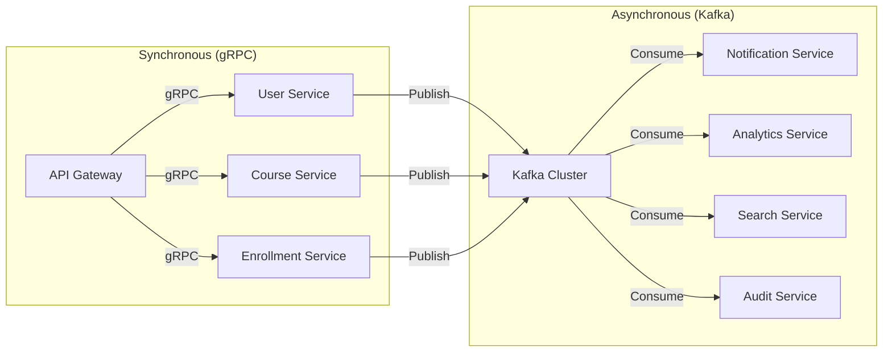

### 6.4 Event Schema

**User Events:**
```json
{
  "event_id": "uuid",
  "event_type": "user.created",
  "timestamp": "2026-02-19T10:00:00Z",
  "tenant_id": "uuid",
  "actor": {
    "user_id": "uuid",
    "email": "user@example.com"
  },
  "data": {
    "user_id": "uuid",
    "email": "newuser@example.com",
    "role": "student"
  },
  "metadata": {
    "ip_address": "192.168.1.1",
    "user_agent": "Mozilla/5.0..."
  }
}
```

**Course Events:**
```json
{
  "event_id": "uuid",
  "event_type": "course.published",
  "timestamp": "2026-02-19T10:00:00Z",
  "tenant_id": "uuid",
  "actor": {
    "user_id": "uuid",
    "email": "instructor@example.com"
  },
  "data": {
    "course_id": "uuid",
    "title": "Introduction to Python",
    "status": "published"
  }
}
```

**Learning Events:**
```json
{
  "event_id": "uuid",
  "event_type": "lesson.completed",
  "timestamp": "2026-02-19T10:00:00Z",
  "tenant_id": "uuid",
  "actor": {
    "user_id": "uuid",
    "email": "student@example.com"
  },
  "data": {
    "enrollment_id": "uuid",
    "course_id": "uuid",
    "lesson_id": "uuid",
    "time_spent_seconds": 1200,
    "score": 0.95
  }
}
```

---

## 7. Data Architecture

### 7.1 Database Strategy

| Database | Use Case | Rationale |
|----------|----------|-----------|
| **PostgreSQL** | Transactional data, user data, courses | ACID compliance, relational integrity |
| **MongoDB** | Content metadata, logs, flexible schemas | Schema flexibility, document model |
| **Redis** | Sessions, caching, rate limiting | In-memory speed, data structures |
| **Elasticsearch** | Search, analytics, aggregations | Full-text search, real-time analytics |
| **S3** | Media files, backups, archives | Durability, cost-effectiveness |

### 7.2 Multi-Tenancy Strategy

**Approach:** Schema-per-tenant for PostgreSQL

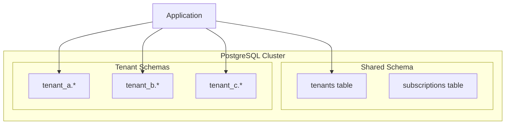

**Benefits:**
- Strong data isolation
- Easy tenant backup/restore
- Simple tenant offboarding
- Compliance-friendly

**Trade-offs:**
- Connection pool per tenant
- Schema migrations require iteration
- Cross-tenant queries complex

---

### 7.3 Core Database Schema

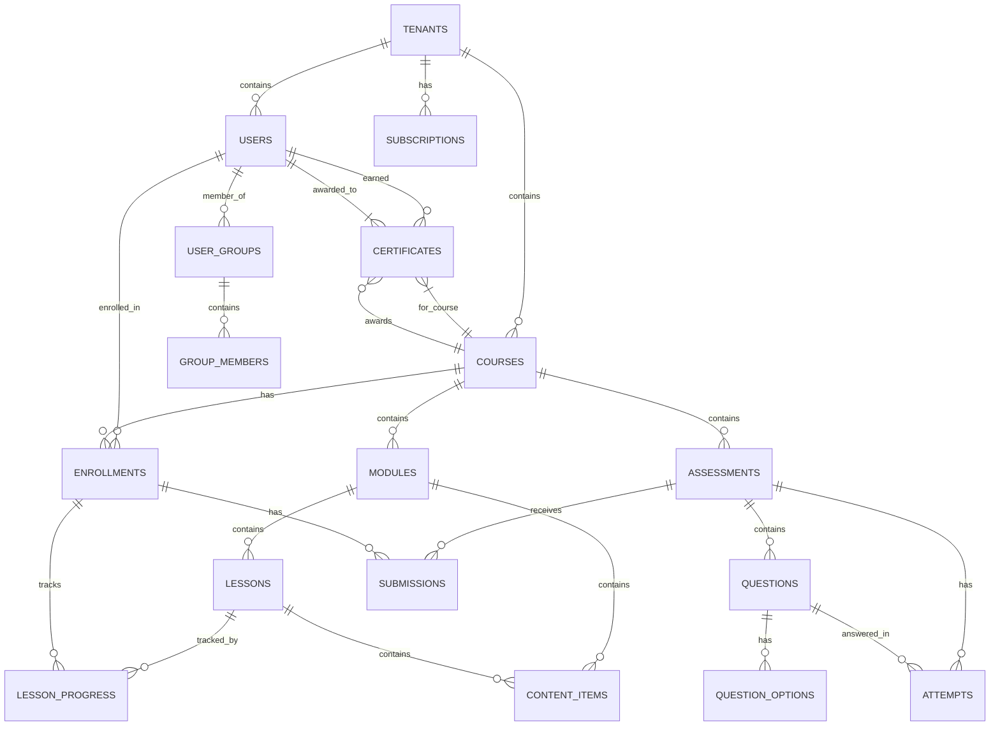

---

### 7.4 Table Definitions

#### Tenants Table (Shared Schema)
```sql
CREATE TABLE tenants (
    id UUID PRIMARY KEY DEFAULT gen_random_uuid(),
    name VARCHAR(255) NOT NULL,
    slug VARCHAR(100) UNIQUE NOT NULL,
    status VARCHAR(20) DEFAULT 'active',
    plan VARCHAR(50) DEFAULT 'starter',
    settings JSONB DEFAULT '{}',
    created_at TIMESTAMP WITH TIME ZONE DEFAULT NOW(),
    updated_at TIMESTAMP WITH TIME ZONE DEFAULT NOW()
);

CREATE INDEX idx_tenants_slug ON tenants(slug);
CREATE INDEX idx_tenants_status ON tenants(status);
```

#### Users Table (Per-Tenant Schema)
```sql
CREATE TABLE users (
    id UUID PRIMARY KEY DEFAULT gen_random_uuid(),
    external_id VARCHAR(255),
    email VARCHAR(255) NOT NULL,
    password_hash VARCHAR(255),
    first_name VARCHAR(100),
    last_name VARCHAR(100),
    avatar_url TEXT,
    role VARCHAR(50) NOT NULL DEFAULT 'student',
    status VARCHAR(20) DEFAULT 'active',
    metadata JSONB DEFAULT '{}',
    last_login_at TIMESTAMP WITH TIME ZONE,
    created_at TIMESTAMP WITH TIME ZONE DEFAULT NOW(),
    updated_at TIMESTAMP WITH TIME ZONE DEFAULT NOW(),
    deleted_at TIMESTAMP WITH TIME ZONE
);

CREATE UNIQUE INDEX idx_users_email ON users(email) WHERE deleted_at IS NULL;
CREATE INDEX idx_users_role ON users(role);
CREATE INDEX idx_users_status ON users(status);
```

#### Courses Table (Per-Tenant Schema)
```sql
CREATE TABLE courses (
    id UUID PRIMARY KEY DEFAULT gen_random_uuid(),
    title VARCHAR(255) NOT NULL,
    description TEXT,
    thumbnail_url TEXT,
    status VARCHAR(20) DEFAULT 'draft',
    visibility VARCHAR(20) DEFAULT 'private',
    settings JSONB DEFAULT '{}',
    created_by UUID REFERENCES users(id),
    published_at TIMESTAMP WITH TIME ZONE,
    created_at TIMESTAMP WITH TIME ZONE DEFAULT NOW(),
    updated_at TIMESTAMP WITH TIME ZONE DEFAULT NOW(),
    deleted_at TIMESTAMP WITH TIME ZONE
);

CREATE INDEX idx_courses_status ON courses(status);
CREATE INDEX idx_courses_created_by ON courses(created_by);
```

#### Enrollments Table (Per-Tenant Schema)
```sql
CREATE TABLE enrollments (
    id UUID PRIMARY KEY DEFAULT gen_random_uuid(),
    user_id UUID REFERENCES users(id) ON DELETE CASCADE,
    course_id UUID REFERENCES courses(id) ON DELETE CASCADE,
    status VARCHAR(20) DEFAULT 'active',
    progress DECIMAL(5,2) DEFAULT 0,
    started_at TIMESTAMP WITH TIME ZONE,
    completed_at TIMESTAMP WITH TIME ZONE,
    expires_at TIMESTAMP WITH TIME ZONE,
    metadata JSONB DEFAULT '{}',
    created_at TIMESTAMP WITH TIME ZONE DEFAULT NOW(),
    updated_at TIMESTAMP WITH TIME ZONE DEFAULT NOW(),
    UNIQUE(user_id, course_id)
);

CREATE INDEX idx_enrollments_user ON enrollments(user_id);
CREATE INDEX idx_enrollments_course ON enrollments(course_id);
CREATE INDEX idx_enrollments_status ON enrollments(status);
```

#### Lesson Progress Table (Per-Tenant Schema)
```sql
CREATE TABLE lesson_progress (
    id UUID PRIMARY KEY DEFAULT gen_random_uuid(),
    enrollment_id UUID REFERENCES enrollments(id) ON DELETE CASCADE,
    lesson_id UUID NOT NULL,
    status VARCHAR(20) DEFAULT 'not_started',
    time_spent_seconds INTEGER DEFAULT 0,
    score DECIMAL(5,2),
    completed_at TIMESTAMP WITH TIME ZONE,
    metadata JSONB DEFAULT '{}',
    created_at TIMESTAMP WITH TIME ZONE DEFAULT NOW(),
    updated_at TIMESTAMP WITH TIME ZONE DEFAULT NOW(),
    UNIQUE(enrollment_id, lesson_id)
);

CREATE INDEX idx_lesson_progress_enrollment ON lesson_progress(enrollment_id);
CREATE INDEX idx_lesson_progress_lesson ON lesson_progress(lesson_id);
```

---

### 7.5 Caching Strategy

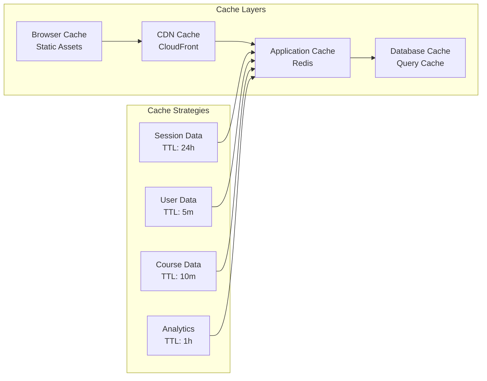

**Cache Invalidation Strategy:**
- **Write-through:** Session data, user preferences
- **Cache-aside:** Course content, user profiles
- **TTL-based:** Analytics, aggregated data
- **Event-driven:** Publish invalidation events on updates

---

### 7.6 Data Retention Policy

| Data Type | Retention Period | Action |
|-----------|------------------|--------|
| **User Data** | Account lifetime + 7 years | Archive then delete |
| **Course Content** | Account lifetime | Delete on tenant removal |
| **Progress Data** | Account lifetime + 3 years | Archive |
| **Audit Logs** | 7 years | Archive to cold storage |
| **Analytics Events** | 2 years | Aggregate, then delete raw |
| **Session Data** | 24 hours | Auto-expire |
| **Temporary Files** | 7 days | Auto-delete |

---

## 8. API Design

### 8.1 API Architecture

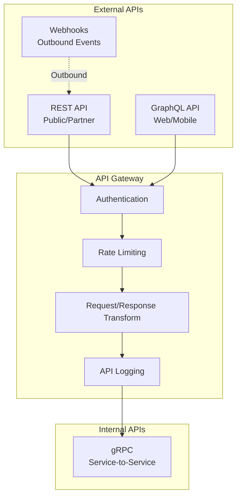

### 8.2 REST API Design

**Versioning Strategy:**
```
/api/v1/resources
/api/v2/resources
```

**Standard Response Format:**
```json
{
  "data": { ... },
  "meta": {
    "request_id": "uuid",
    "timestamp": "2026-02-19T10:00:00Z"
  },
  "pagination": {
    "page": 1,
    "per_page": 20,
    "total": 100,
    "total_pages": 5
  },
  "errors": []
}
```

**Error Response Format:**
```json
{
  "error": {
    "code": "VALIDATION_ERROR",
    "message": "Invalid input provided",
    "details": [
      {
        "field": "email",
        "message": "Invalid email format"
      }
    ]
  },
  "meta": {
    "request_id": "uuid",
    "timestamp": "2026-02-19T10:00:00Z"
  }
}
```

---

### 8.3 GraphQL Schema (Excerpt)

```graphql
type Query {
  # Courses
  courses(filter: CourseFilter, pagination: PaginationInput): CourseConnection!
  course(id: ID!): Course
  
  # Users
  users(filter: UserFilter, pagination: PaginationInput): UserConnection!
  user(id: ID!): User
  me: User
  
  # Enrollments
  enrollments(filter: EnrollmentFilter): [Enrollment!]!
  myEnrollments: [Enrollment!]!
  
  # Analytics
  dashboard(courseId: ID, dateRange: DateRangeInput): DashboardData!
  courseAnalytics(courseId: ID!): CourseAnalytics!
}

type Mutation {
  # Authentication
  login(email: String!, password: String!): AuthPayload!
  logout: Boolean!
  refreshToken(refreshToken: String!): AuthPayload!
  
  # Courses
  createCourse(input: CreateCourseInput!): Course!
  updateCourse(id: ID!, input: UpdateCourseInput!): Course!
  deleteCourse(id: ID!): Boolean!
  publishCourse(id: ID!): Course!
  
  # Enrollments
  enrollUser(courseId: ID!, userId: ID!): Enrollment!
  completeEnrollment(enrollmentId: ID!): Enrollment!
  
  # Content
  uploadContent(input: UploadContentInput!): Content!
  deleteContent(id: ID!): Boolean!
}

type Subscription {
  # Real-time updates
  enrollmentProgress(enrollmentId: ID!): EnrollmentProgress!
  courseUpdates(courseId: ID!): CourseUpdate!
  notification(userId: ID!): Notification!
}

type Course {
  id: ID!
  title: String!
  description: String
  thumbnailUrl: String
  status: CourseStatus!
  visibility: Visibility!
  modules: [Module!]!
  enrollmentCount: Int!
  averageRating: Float
  createdBy: User!
  createdAt: DateTime!
  updatedAt: DateTime!
}

type Enrollment {
  id: ID!
  user: User!
  course: Course!
  status: EnrollmentStatus!
  progress: Float!
  startedAt: DateTime
  completedAt: DateTime
  certificates: [Certificate!]!
}
```

---

### 8.4 Rate Limiting

| Tier | Rate Limit | Burst |
|------|------------|-------|
| **Free** | 100 requests/minute | 200 |
| **Starter** | 500 requests/minute | 1000 |
| **Professional** | 2000 requests/minute | 4000 |
| **Enterprise** | 10000 requests/minute | 20000 |
| **Internal Services** | No limit | N/A |

**Rate Limit Headers:**
```
X-RateLimit-Limit: 1000
X-RateLimit-Remaining: 999
X-RateLimit-Reset: 1645267200
```

---

### 8.5 Webhook Events

| Event | Payload | Retry Policy |
|-------|---------|--------------|
| `user.created` | User object | 3 retries, exponential backoff |
| `user.deleted` | User ID | 3 retries, exponential backoff |
| `course.published` | Course object | 3 retries, exponential backoff |
| `enrollment.created` | Enrollment object | 3 retries, exponential backoff |
| `enrollment.completed` | Enrollment + Certificate | 3 retries, exponential backoff |
| `assessment.submitted` | Submission object | 3 retries, exponential backoff |
| `certificate.issued` | Certificate object | 3 retries, exponential backoff |

---

## 9. Security Architecture

### 9.1 Security Layers

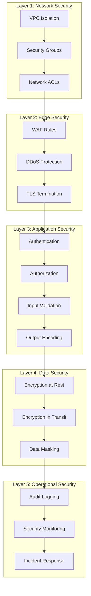

---

### 9.2 Authentication Architecture

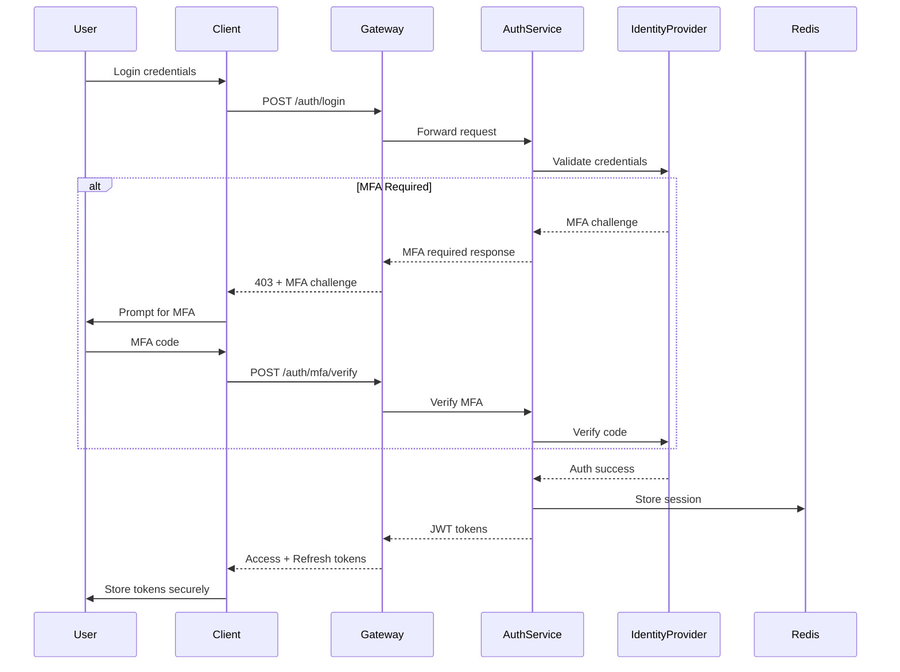

**Token Structure:**
```json
{
  "sub": "user-uuid",
  "iss": "learnhub.com",
  "aud": "learnhub-api",
  "exp": 1645270800,
  "iat": 1645267200,
  "jti": "token-uuid",
  "tenant_id": "tenant-uuid",
  "roles": ["student", "instructor"],
  "permissions": ["course:read", "enrollment:create"]
}
```

---

### 9.3 Authorization Model

**RBAC + ABAC Hybrid:**

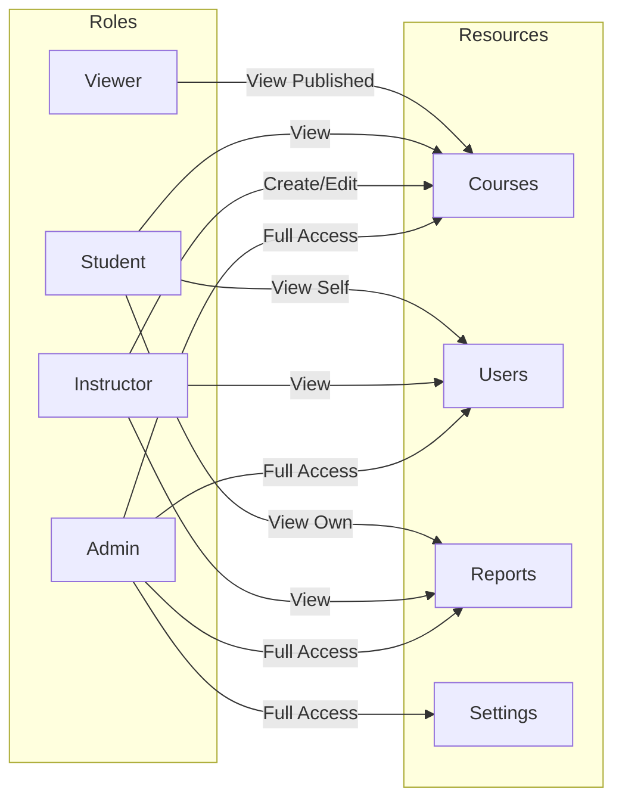

**Policy Example (OPA/Rego):**
```rego
package authz

default allow = false

allow {
    input.subject.roles[_] == "admin"
}

allow {
    input.action == "read"
    input.resource.type == "course"
    input.resource.status == "published"
}

allow {
    input.action == "update"
    input.resource.type == "course"
    input.subject.roles[_] == "instructor"
    input.resource.owner_id == input.subject.id
}
```

---

### 9.4 Data Protection

**Encryption at Rest:**
- PostgreSQL: AWS RDS encryption (AES-256)
- MongoDB: WiredTiger encryption
- Redis: Encrypted persistence
- S3: SSE-S3 or SSE-KMS
- EBS: Encrypted volumes

**Encryption in Transit:**
- TLS 1.3 for all external communication
- mTLS for internal service communication
- Certificate rotation every 90 days

**Key Management:**
- AWS KMS for key management
- Envelope encryption for data keys
- Automatic key rotation annually

---

### 9.5 Security Compliance Matrix

| Requirement | Implementation | Status |
|-------------|----------------|--------|
| **SOC 2 Type II** | Audit logging, access controls, encryption | Target: Month 6 |
| **GDPR** | Data residency, right to deletion, consent | Target: Launch |
| **FERPA** | Educational record protection | Target: Launch |
| **CCPA** | Privacy rights, data access | Target: Launch |
| **WCAG 2.1 AA** | Accessibility compliance | Target: Launch |
| **ISO 27001** | ISMS implementation | Target: Year 2 |

---

## 10. Scalability & Performance

### 10.1 Capacity Planning

**Back-of-the-Envelope Calculations:**

| Metric | Calculation | Result |
|--------|-------------|--------|
| **Target Users** | 10M registered | - |
| **DAU** | 10M × 20% | 2M daily active |
| **Peak Concurrent** | 2M × 10% × 20% | 40,000 concurrent |
| **API Requests/Day** | 2M × 100 | 200M requests |
| **API Requests/Second (avg)** | 200M / 86400 | ~2,300 RPS |
| **API Requests/Second (peak)** | 2,300 × 5 | ~11,500 RPS |
| **Storage Growth/Day** | 2M × 1MB | 2TB/day |
| **Storage Growth/Year** | 2TB × 365 | 730TB/year |
| **Bandwidth (Video)** | 2M × 10min × 5Mbps | ~200 Gbps peak |

---

### 10.2 Scaling Strategy

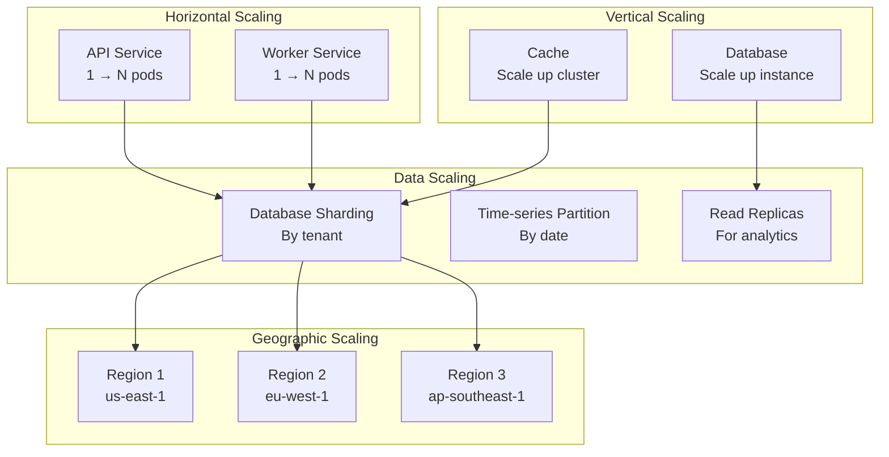

---

### 10.3 Database Scaling

**Read Scaling:**
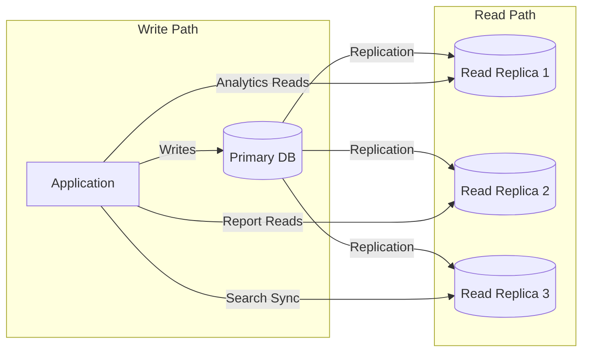

**Sharding Strategy:**
- **Shard Key:** `tenant_id`
- **Rationale:** Natural isolation, even distribution
- **Implementation:** PostgreSQL schemas + connection routing

---

### 10.4 Caching Architecture

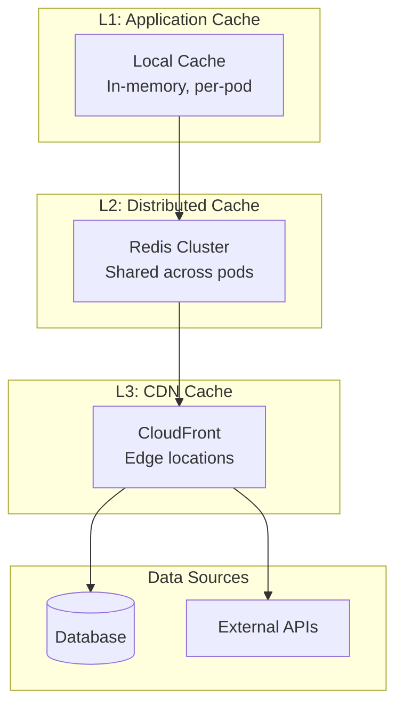

**Cache Hit Rate Targets:**
- Session data: 99%+
- User profiles: 95%+
- Course content: 90%+
- Analytics: 80%+

---

### 10.5 Performance Optimization

| Optimization | Target | Implementation |
|--------------|--------|----------------|
| **Database Query Optimization** | P95 < 50ms | Indexes, query planning, connection pooling |
| **API Response Time** | P95 < 200ms | Caching, async processing, pagination |
| **Video Start Time** | < 1 second | CDN, adaptive bitrate, preloading |
| **Page Load Time** | < 2 seconds | Code splitting, lazy loading, compression |
| **Search Response** | < 500ms | Elasticsearch optimization, query caching |

---

## 11. Infrastructure & Deployment

### 11.1 AWS Architecture

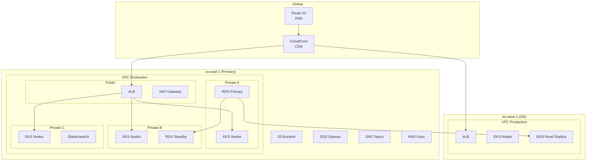

---

### 11.2 Kubernetes Architecture

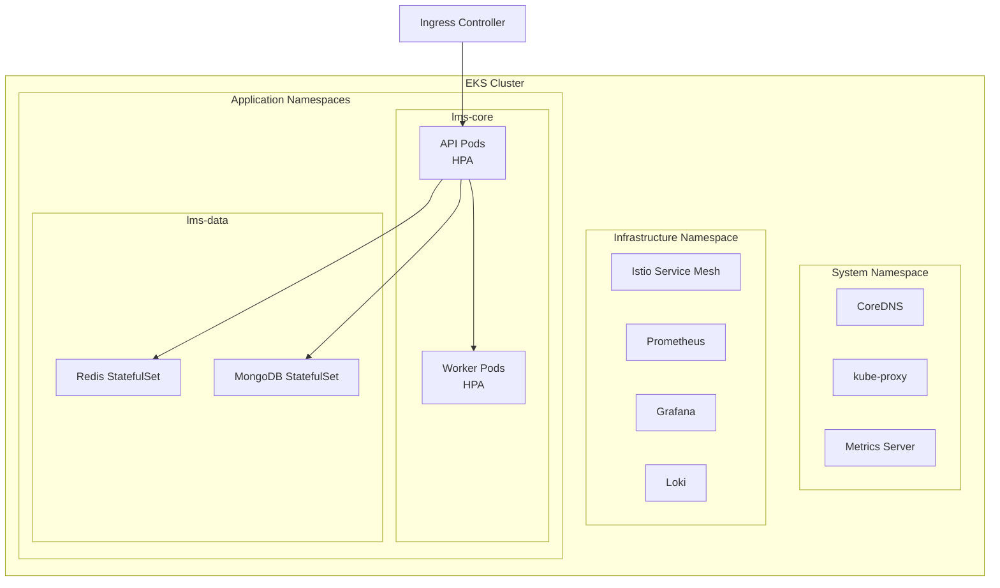

---

### 11.3 CI/CD Pipeline

```mermaid
flowchart LR
    subgraph "Source"
        git[GitHub Repository]
    end
    
    subgraph "CI (GitHub Actions)"
        lint[Lint & Format]
        test_unit[Unit Tests]
        test_integration[Integration Tests]
        security[Security Scan]
        build[Build Container]
        push[Push to ECR]
    end
    
    subgraph "CD (ArgoCD)"
        dev[Deploy to Dev]
        staging[Deploy to Staging]
        test_e2e[E2E Tests]
        prod[Deploy to Production]
    end
    
    git --> lint
    lint --> test_unit
    test_unit --> test_integration
    test_integration --> security
    security --> build
    build --> push
    push --> dev
    dev --> staging
    staging --> test_e2e
    test_e2e --> prod
```

---

### 11.4 Deployment Strategy

**Blue-Green Deployment:**
```mermaid
sequenceDiagram
    participant LB
    participant Blue
    participant Green
    participant Deploy
    
    Note over LB,Blue: Blue is active (v1.0)
    Deploy->>Green: Deploy new version (v1.1)
    Note over Green: Run health checks
    Deploy->>LB: Switch traffic to Green
    Note over LB,Green: Green is active (v1.1)
    Deploy->>Blue: Terminate old version
```

**Canary Deployment:**
```mermaid
sequenceDiagram
    participant LB
    participant Stable
    participant Canary
    participant Monitor
    
    Note over LB,Stable: Stable receives 100% traffic
    Monitor->>Canary: Deploy canary (5%)
    LB->>Canary: Route 5% traffic
    Monitor->>Monitor: Check metrics (5 min)
    alt Metrics OK
        Monitor->>Canary: Increase to 25%
        Monitor->>Monitor: Check metrics (5 min)
        Monitor->>Canary: Increase to 50%
        Monitor->>Monitor: Check metrics (5 min)
        Monitor->>Canary: Increase to 100%
    else Metrics Bad
        Monitor->>LB: Rollback to stable
    end
```

---

## 12. Observability

### 12.1 Observability Stack

```mermaid
flowchart TB
    subgraph "Data Collection"
        prometheus[Prometheus<br/>Metrics]
        fluentbit[Fluent Bit<br/>Logs]
        jaeger[Jaeger Agent<br/>Traces]
    end
    
    subgraph "Data Storage"
        prom_storage[(Prometheus<br/>TSDB)]
        loki[(Loki<br/>Logs)]
        tempo[(Tempo<br/>Traces)]
    end
    
    subgraph "Visualization"
        grafana[Grafana<br/>Dashboards]
    end
    
    subgraph "Alerting"
        alertmanager[Alertmanager]
        pagerduty[PagerDuty]
    end
    
    prometheus --> prom_storage
    fluentbit --> loki
    jaeger --> tempo
    
    prom_storage --> grafana
    loki --> grafana
    tempo --> grafana
    
    prometheus --> alertmanager
    alertmanager --> pagerduty
```

---

### 12.2 Key Metrics (Golden Signals)

| Signal | Metric | Alert Threshold |
|--------|--------|-----------------|
| **Latency** | API P95 response time | > 500ms |
| **Traffic** | Requests per second | > 10,000 RPS |
| **Errors** | Error rate (5xx) | > 1% |
| **Saturation** | CPU utilization | > 80% |
| **Saturation** | Memory utilization | > 85% |
| **Saturation** | Database connections | > 90% |

---

### 12.3 Dashboard Structure

```mermaid
mindmap
  root((Grafana Dashboards))
    Executive
      DAU/MAU
      Revenue Metrics
      Customer Health
    Platform
      API Performance
      Error Rates
      Resource Utilization
    Services
      Per-Service Metrics
      Dependencies
      SLA Compliance
    Business
      Course Completions
      User Engagement
      Conversion Funnel
    Security
      Failed Logins
      Rate Limit Hits
      Suspicious Activity
```

---

### 12.4 Logging Strategy

**Log Levels:**
| Level | Usage |
|-------|-------|
| **ERROR** | Actionable failures, user-impacting issues |
| **WARN** | Potential issues, degraded functionality |
| **INFO** | Business events, state changes |
| **DEBUG** | Detailed diagnostic information |
| **TRACE** | Full request/response details |

**Structured Log Format:**
```json
{
  "timestamp": "2026-02-19T10:00:00Z",
  "level": "INFO",
  "service": "course-service",
  "trace_id": "abc123",
  "span_id": "def456",
  "tenant_id": "tenant-uuid",
  "user_id": "user-uuid",
  "event": "course.published",
  "data": {
    "course_id": "course-uuid",
    "title": "Introduction to Python"
  },
  "duration_ms": 45
}
```

---

## 13. Disaster Recovery

### 13.1 RTO/RPO Targets

| Component | RTO | RPO |
|-----------|-----|-----|
| **API Services** | 15 minutes | 0 (stateless) |
| **Database (Primary)** | 1 hour | 5 minutes |
| **Cache** | 15 minutes | 0 (rebuildable) |
| **Object Storage** | 4 hours | 0 (durable) |
| **Search Index** | 2 hours | 1 hour |

---

### 13.2 Backup Strategy

```mermaid
flowchart TB
    subgraph "Automated Backups"
        rds_backup[RDS Automated<br/>Every 5 min]
        mongo_backup[MongoDB Snapshots<br/>Hourly]
        s3_versioning[S3 Versioning<br/>Enabled]
    end
    
    subgraph "Scheduled Backups"
        daily[Daily Full Backup<br/>Retain 30 days]
        weekly[Weekly Full Backup<br/>Retain 12 weeks]
        monthly[Monthly Full Backup<br/>Retain 12 months]
    end
    
    subgraph "Offsite Replication"
        cross_region[Cross-Region<br/>Replication]
        glacier[Glacier Deep Archive<br/>Long-term]
    end
    
    rds_backup --> daily
    mongo_backup --> daily
    s3_versioning --> daily
    
    daily --> weekly
    weekly --> monthly
    monthly --> cross_region
    monthly --> glacier
```

---

### 13.3 Failover Architecture

```mermaid
flowchart TB
    subgraph "Primary Region (us-east-1)"
        primary_lb[Load Balancer]
        primary_api[API Services]
        primary_db[(Primary DB)]
    end
    
    subgraph "DR Region (eu-west-1)"
        dr_lb[Load Balancer]
        dr_api[API Services]
        dr_db[(Read Replica)]
    end
    
    subgraph "DNS Failover"
        route53[Route 53<br/>Health Checks]
    end
    
    route53 -->|Primary Healthy| primary_lb
    route53 -->|Primary Unhealthy| dr_lb
    
    primary_db -->|Async Replication| dr_db
    
    dr_db -->|Promote on Failover| dr_api
```

---

### 13.4 DR Testing Schedule

| Test Type | Frequency | Duration | Scope |
|-----------|-----------|----------|-------|
| **Backup Verification** | Weekly | 1 hour | Sample restore |
| **Failover Drill** | Monthly | 4 hours | Full region failover |
| **Chaos Engineering** | Quarterly | 1 day | Random failures |
| **Full DR Test** | Annually | 1 week | Complete DR activation |

---

## 14. Cost Estimation

### 14.1 Infrastructure Cost Breakdown (Monthly)

| Category | Service | Launch (10K users) | Growth (100K users) | Scale (1M users) |
|----------|---------|---------------------|---------------------|------------------|
| **Compute** | EKS (EC2) | $5,000 | $25,000 | $150,000 |
| **Database** | RDS PostgreSQL | $2,000 | $10,000 | $50,000 |
| **Cache** | ElastiCache Redis | $500 | $2,500 | $15,000 |
| **Storage** | S3 + EBS | $1,000 | $5,000 | $30,000 |
| **CDN** | CloudFront | $500 | $3,000 | $20,000 |
| **Networking** | NAT, ALB, Transfer | $1,000 | $5,000 | $25,000 |
| **Monitoring** | Grafana Cloud | $200 | $500 | $2,000 |
| **Other** | SQS, SNS, Lambda | $300 | $1,000 | $5,000 |
| **Total** | | **$10,500** | **$52,000** | **$297,000** |

---

### 14.2 Cost Optimization Strategies

| Strategy | Potential Savings | Implementation |
|----------|-------------------|----------------|
| **Reserved Instances** | 30-40% | 1-3 year commitments |
| **Spot Instances** | 60-70% | Stateless workloads |
| **Auto-scaling** | 20-30% | Scale down during off-peak |
| **S3 Lifecycle** | 40-60% | Move old data to Glacier |
| **Right-sizing** | 10-20% | Regular instance optimization |
| **Data Transfer** | 10-15% | VPC endpoints, CDN optimization |

---

### 14.3 Unit Economics

| Metric | Launch | Growth | Scale |
|--------|--------|--------|-------|
| **Infrastructure Cost/User/Month** | $1.05 | $0.52 | $0.30 |
| **Target Price/User/Month** | $5.00 | $5.00 | $5.00 |
| **Gross Margin** | 79% | 90% | 94% |

---

## 15. Appendices

### 15.1 Glossary

| Term | Definition |
|------|------------|
| **ALB** | Application Load Balancer |
| **API** | Application Programming Interface |
| **CDN** | Content Delivery Network |
| **CI/CD** | Continuous Integration/Continuous Deployment |
| **DR** | Disaster Recovery |
| **EKS** | Elastic Kubernetes Service |
| **HPA** | Horizontal Pod Autoscaler |
| **KMS** | Key Management Service |
| **LMS** | Learning Management System |
| **mTLS** | Mutual Transport Layer Security |
| **OPA** | Open Policy Agent |
| **RDS** | Relational Database Service |
| **RPO** | Recovery Point Objective |
| **RTO** | Recovery Time Objective |
| **SCORM** | Sharable Content Object Reference Model |
| **SLA** | Service Level Agreement |
| **SLO** | Service Level Objective |
| **VPC** | Virtual Private Cloud |
| **WAF** | Web Application Firewall |
| **xAPI** | Experience API |

---

### 15.2 References

1. AWS Well-Architected Framework
2. Google Site Reliability Engineering Books
3. Kubernetes Best Practices
4. OWASP Top 10
5. Twelve-Factor App Methodology
6. Domain-Driven Design (Eric Evans)
7. Building Microservices (Sam Newman)

---

### 15.3 Document History

| Version | Date | Author | Changes |
|---------|------|--------|---------|
| 0.1 | 2026-02-05 | Architecture Team | Initial draft |
| 0.5 | 2026-02-12 | Architecture Team | Added data models, API specs |
| 1.0 | 2026-02-19 | Architecture Team | Final review version |

---

### 15.4 Approval Sign-off

| Role | Name | Signature | Date |
|------|------|-----------|------|
| **Chief Architect** | | | |
| **VP Engineering** | | | |
| **Security Lead** | | | |
| **DevOps Lead** | | | |
| **Database Lead** | | | |

---

*This document is confidential and intended for internal use only.*

**Document End**
