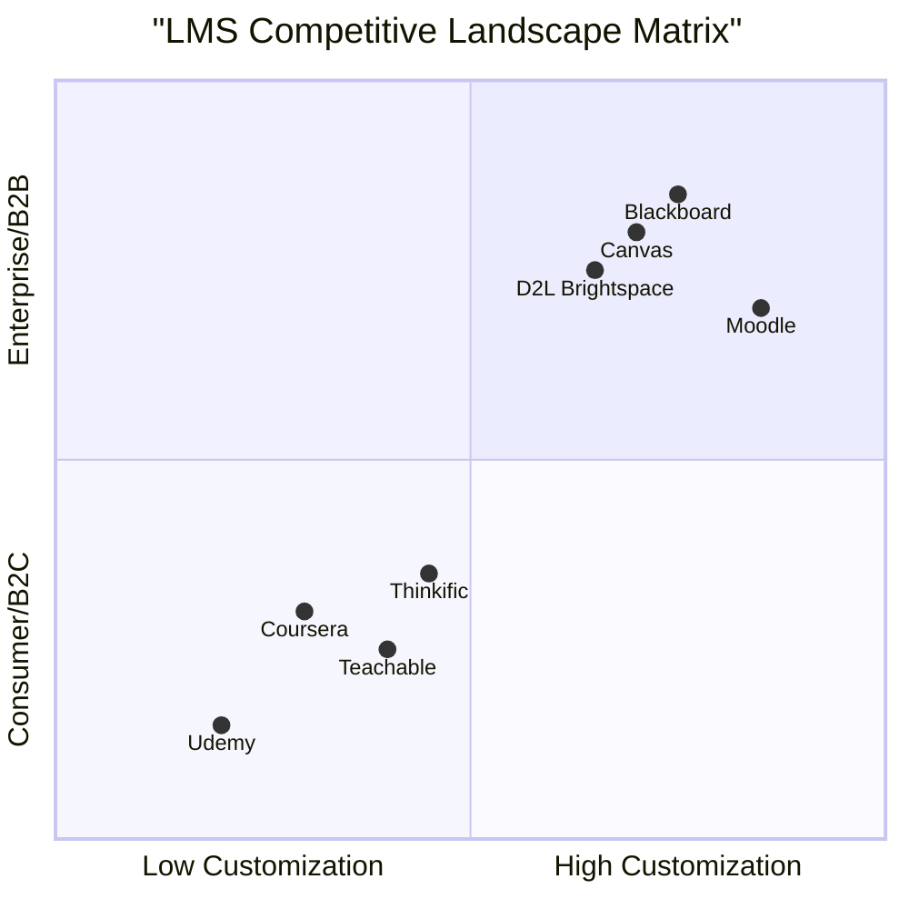
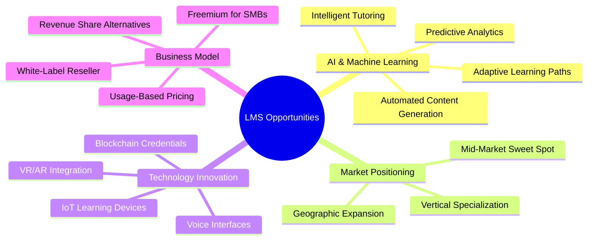

# Competitive Analysis: Learning Management System (LMS) Market

**Document Version:** 1.0  
**Last Updated:** February 19, 2026  
**Prepared By:** Product Strategy Team  
**Classification:** Internal Use

---

## Executive Summary

The global Learning Management System (LMS) market is experiencing significant growth, projected to reach **$45.8 billion by 2030** with a CAGR of 14.6%. This analysis examines the competitive landscape across three primary segments:

1. **Enterprise/Academic LMS** - Canvas, Moodle, Blackboard
2. **MOOC Platforms** - Coursera, edX, FutureLearn
3. **Course Creation Platforms** - Udemy, Teachable, Thinkific

This document provides actionable insights for positioning our LMS platform to capture market share through differentiated features and strategic pricing.

---

## 1. Market Segmentation Overview

---

## 2. Enterprise/Academic LMS Analysis

### 2.1 Canvas LMS (Instructure)

| Attribute | Details |
|-----------|---------|
| **Market Share** | ~30% of US higher education market |
| **Primary Audience** | K-12, Higher Education, Enterprise |
| **Deployment** | Cloud (SaaS) and On-Premise |
| **Founded** | 2008 |

#### Pricing Model
| Tier | Price | Features |
|------|-------|----------|
| **K-12** | Custom quote | Full LMS, SIS integration |
| **Higher Ed** | $4-8 per student/year | Full platform + analytics |
| **Enterprise** | Custom quote | Corporate training features |

#### Strengths
- ✅ **Intuitive UI/UX** - Consistently rated highest for user experience
- ✅ **Mobile-first design** - Native iOS/Android apps with full functionality
- ✅ **Robust API ecosystem** - 200+ integrations via Canvas App Center
- ✅ **Learning analytics** - Canvas Data provides deep insights
- ✅ **Accessibility** - WCAG 2.1 AA compliant

#### Weaknesses
- ❌ **Limited customization** - Closed-source core limits deep customization
- ❌ **Pricing opacity** - No transparent pricing, requires sales engagement
- ❌ **Performance issues** - Reported slowdowns during peak usage
- ❌ **Support quality variance** - Dependent on institution's contract tier

---

### 2.2 Moodle

| Attribute | Details |
|-----------|---------|
| **Market Share** | ~200M+ users globally, 75,000+ sites |
| **Primary Audience** | Higher Education, Government, Non-profits |
| **Deployment** | Self-hosted (free) or MoodleCloud (SaaS) |
| **Founded** | 2002 |

#### Pricing Model
| Tier | Price | Features |
|------|-------|----------|
| **Open Source** | Free (self-hosted) | Full LMS, community support |
| **MoodleCloud** | $110-$590/year | Hosted, 50-250 users |
| **Certified Partners** | Custom | Enterprise hosting, support |

#### Strengths
- ✅ **Open source flexibility** - Complete code access for customization
- ✅ **Cost-effective** - Free core platform
- ✅ **Global community** - 1M+ developers, 1,800+ plugins
- ✅ **Multilingual** - 120+ language packs
- ✅ **Privacy-focused** - Full data control when self-hosted

#### Weaknesses
- ❌ **Dated UI** - Interface feels outdated compared to modern competitors
- ❌ **Technical debt** - Legacy codebase, inconsistent architecture
- ❌ **Self-hosting burden** - Requires dedicated IT resources
- ❌ **Plugin quality variance** - Community plugins vary in quality/security
- ❌ **Mobile experience** - App is functional but limited

---

### 2.3 Blackboard Learn

| Attribute | Details |
|-----------|---------|
| **Market Share** | ~20% of US higher education (declining) |
| **Primary Audience** | Higher Education, Enterprise |
| **Deployment** | SaaS, Managed Hosting, Self-hosted |
| **Founded** | 1997 |

#### Pricing Model
| Tier | Price | Features |
|------|-------|----------|
| **Standard** | Custom quote | Core LMS features |
| **Enterprise** | Custom quote | Advanced analytics, integrations |
| **Ultra** | Premium pricing | Modern UI, enhanced features |

#### Strengths
- ✅ **Enterprise-grade security** - SOC 2, FERPA compliant
- ✅ **Comprehensive feature set** - Deep functionality for complex institutions
- ✅ **Established ecosystem** - Long history, extensive integrations
- ✅ **Blackboard Collaborate** - Integrated virtual classroom
- ✅ **Assessment tools** - Advanced testing and plagiarism detection

#### Weaknesses
- ❌ **Poor user experience** - Consistently low satisfaction scores
- ❌ **Complex administration** - Steep learning curve for admins
- ❌ **High total cost** - Expensive licensing + implementation + maintenance
- ❌ **Slow innovation** - Legacy architecture limits agility
- ❌ **Customer support issues** - Frequent complaints about responsiveness

---

### 2.4 D2L Brightspace

| Attribute | Details |
|-----------|---------|
| **Market Share** | ~10M users globally |
| **Primary Audience** | Higher Education, K-12, Enterprise |
| **Deployment** | Cloud SaaS primarily |
| **Founded** | 1999 |

#### Pricing Model
| Tier | Price | Features |
|------|-------|----------|
| **Education** | Custom quote | Full LMS, analytics |
| **Corporate** | Custom quote | Extended enterprise features |
| **Government** | Custom quote | Enhanced security, compliance |

#### Strengths
- ✅ **Adaptive learning** - AI-powered personalized learning paths
- ✅ **Strong analytics** - Built-in predictive analytics
- ✅ **Video integration** - Native video platform (D2L Video)
- ✅ **Accessibility** - Strong WCAG compliance
- ✅ **Competency-based education** - Advanced skills tracking

#### Weaknesses
- ❌ **Market presence** - Smaller market share limits ecosystem
- ❌ **Pricing** - Premium pricing without proportional value perception
- ❌ **Integration complexity** - Some third-party integrations challenging
- ❌ **Brand recognition** - Less recognized than Canvas/Blackboard

---

## 3. MOOC Platform Analysis

### 3.1 Coursera

| Attribute | Details |
|-----------|---------|
| **Market Share** | 100M+ registered learners |
| **Primary Audience** | Individual learners, Enterprise, Universities |
| **Business Model** | B2C subscriptions + B2B enterprise + University partnerships |
| **Founded** | 2012 |

#### Pricing Model
| Tier | Price | Features |
|------|-------|----------|
| **Audit** | Free | Course content access (no certificate) |
| **Coursera Plus** | $399/year or $59/month | Unlimited courses, certificates |
| **Professional Certificates** | $39-79/month | Career-focused programs |
| **Degrees** | $9,000-45,000 | Full online degrees |
| **Coursera for Business** | $400/user/year | Enterprise training |
| **Coursera for Campus** | Custom | University partnerships |

#### Strengths
- ✅ **Premium content** - Partnerships with top universities (Stanford, Yale, etc.)
- ✅ **Brand credibility** - Recognized certificates valued by employers
- ✅ **Career focus** - Strong professional certificate programs
- ✅ **Enterprise growth** - Rapidly growing B2B segment
- ✅ **Mobile experience** - Excellent mobile apps

#### Weaknesses
- ❌ **Limited customization** - Institutions cannot white-label extensively
- ❌ **Revenue share** - Takes significant cut from course sales
- ❌ **Completion rates** - Typical MOOC low completion (~5-15%)
- ❌ **Content control** - Limited instructor control over pricing/promotion

---

### 3.2 edX

| Attribute | Details |
|-----------|---------|
| **Market Share** | 40M+ registered learners |
| **Primary Audience** | Individual learners, Universities, Enterprise |
| **Business Model** | Non-profit (originally), now owned by 2U |
| **Founded** | 2012 (MIT & Harvard) |

#### Pricing Model
| Tier | Price | Features |
|------|-------|----------|
| **Audit Track** | Free | Course content access |
| **Verified Track** | $50-300/course | Certificate, graded assignments |
| **Executive Education** | $1,500-3,500 | Professional programs |
| **MicroMasters** | $600-1,500 | Graduate-level series |
| **Online Degrees** | $10,000-25,000 | Full master's degrees |

#### Strengths
- ✅ **Academic credibility** - Founded by MIT/Harvard
- ✅ **Open source platform** - Open edX available for self-hosting
- ✅ **University partnerships** - 160+ leading universities
- ✅ **Non-profit heritage** - Mission-driven (though now for-profit)
- ✅ **Credit pathways** - Courses can count toward degrees

#### Weaknesses
- ❌ **2U acquisition concerns** - Uncertainty about future direction
- ❌ **User experience** - Interface less polished than Coursera
- ❌ **Marketing reach** - Smaller audience than Coursera
- ❌ **Enterprise presence** - Less developed B2B offering

---

## 4. Course Creation Platform Analysis

### 4.1 Udemy

| Attribute | Details |
|-----------|---------|
| **Market Share** | 57M+ students, 70,000+ instructors |
| **Primary Audience** | Individual learners, Udemy Business customers |
| **Business Model** | Marketplace (revenue share) + Enterprise |
| **Founded** | 2010 |

#### Pricing Model
| Tier | Price | Features |
|------|-------|----------|
| **Individual Courses** | $12.99-199.99 (frequent sales) | Lifetime access |
| **Udemy Personal Plan** | $30/month | 11,000+ top courses |
| **Udemy Business** | $360/user/year (Team), $600/user/year (Enterprise) | Curated content, analytics |
| **Instructor Revenue** | 37% (organic), 97% (instructor referrals) | Revenue share model |

#### Strengths
- ✅ **Massive content library** - 210,000+ courses
- ✅ **Low barrier to entry** - Anyone can become an instructor
- ✅ **Marketplace discovery** - Built-in audience for instructors
- ✅ **Frequent promotions** - Aggressive pricing drives volume
- ✅ **Udemy Business growth** - Strong enterprise segment

#### Weaknesses
- ❌ **Quality variance** - No quality gate, inconsistent course quality
- ❌ **Race to bottom pricing** - Constant $10-15 sales devalue content
- ❌ **Limited branding** - Instructors cannot build their own brand
- ❌ **Revenue share** - Only 37% on organic sales
- ❌ **No white-label** - Cannot customize platform

---

### 4.2 Teachable

| Attribute | Details |
|-----------|---------|
| **Market Share** | 100,000+ creators, $500M+ course sales |
| **Primary Audience** | Individual creators, Small businesses |
| **Business Model** | SaaS subscription + transaction fees |
| **Founded** | 2014 |

#### Pricing Model
| Tier | Price | Features |
|------|-------|----------|
| **Free** | $0 + $1+2% transaction fee | 10 students, basic features |
| **Basic** | $39/month + 5% fee | Unlimited students, drip content |
| **Pro** | $119/month + 0% fee | Advanced reports, priority support |
| **Business** | $399/month + 0% fee | Advanced features, bulk enroll |
| **Enterprise** | Custom | Dedicated support, SLA |

#### Strengths
- ✅ **Creator-focused** - Built specifically for course creators
- ✅ **White-label capability** - Custom domains, branding
- ✅ **Marketing tools** - Built-in email, coupons, affiliates
- ✅ **Payment processing** - Handles VAT, multiple currencies
- ✅ **Ease of use** - Intuitive course builder

#### Weaknesses
- ❌ **Limited advanced features** - Not suitable for complex institutions
- ❌ **Transaction fees** - Fees on lower tiers impact margins
- ❌ **Scalability concerns** - May outgrow platform at enterprise scale
- ❌ **Integration limits** - Fewer third-party integrations than competitors
- ❌ **Student management** - Basic compared to enterprise LMS

---

### 4.3 Thinkific

| Attribute | Details |
|-----------|---------|
| **Market Share** | 50,000+ creators, $3B+ course sales |
| **Primary Audience** | Individual creators, Small-medium businesses |
| **Business Model** | SaaS subscription (no transaction fees) |
| **Founded** | 2012 |

#### Pricing Model
| Tier | Price | Features |
|------|-------|----------|
| **Free** | $0 | 1 course, unlimited students |
| **Basic** | $49/month | Unlimited courses, live lessons |
| **Start** | $99/month | Remove branding, communities |
| **Grow** | $199/month | Advanced marketing, bulk enroll |
| **Expand** | $499/month | Advanced customization, API |
| **Enterprise** | Custom | Dedicated support, SLA |

#### Strengths
- ✅ **No transaction fees** - Keep 100% of revenue on all plans
- ✅ **Feature-rich** - More features at comparable price points
- ✅ **Community features** - Built-in community platform
- ✅ **Customization** - More theme customization than Teachable
- ✅ **API access** - Better API for integrations

#### Weaknesses
- ❌ **Learning curve** - More features = more complexity
- ❌ **Template quality** - Some templates feel dated
- ❌ **Support responsiveness** - Mixed reviews on support quality
- ❌ **Mobile app** - Limited native mobile experience
- ❌ **Brand recognition** - Less known than Teachable

---

## 5. Feature Comparison Matrix

| Feature | Canvas | Moodle | Blackboard | Coursera | Udemy | Teachable | Thinkific |
|---------|--------|--------|------------|----------|-------|-----------|-----------|
| **White-label** | Partial | ✅ Full | Partial | ❌ | ❌ | ✅ Full | ✅ Full |
| **Open Source** | ❌ | ✅ Full | ❌ | ❌ | ❌ | ❌ | ❌ |
| **Mobile Apps** | ✅ Native | ✅ Basic | ✅ Native | ✅ Native | ✅ Native | ⚠️ Limited | ⚠️ Limited |
| **Video Hosting** | 3rd Party | 3rd Party | Integrated | ✅ Native | ✅ Native | ✅ Native | ✅ Native |
| **Live Classes** | Integrations | Plugins | ✅ Collaborate | ✅ | ❌ | ✅ | ✅ |
| **Gamification** | ⚠️ Limited | ✅ Plugins | ⚠️ Limited | ⚠️ Limited | ❌ | ⚠️ Limited | ✅ Basic |
| **AI Features** | ⚠️ Emerging | ❌ | ⚠️ Limited | ✅ | ❌ | ⚠️ Limited | ⚠️ Limited |
| **Analytics** | ✅ Advanced | ⚠️ Basic | ✅ Advanced | ✅ Advanced | ⚠️ Basic | ⚠️ Basic | ⚠️ Basic |
| **Certifications** | ✅ | ✅ | ✅ | ✅ | ✅ | ✅ | ✅ |
| **SCORM/xAPI** | ✅ | ✅ | ✅ | ❌ | ❌ | ❌ | ❌ |
| **API Access** | ✅ Robust | ✅ Robust | ✅ | ⚠️ Limited | ⚠️ Limited | ⚠️ Limited | ✅ Good |
| **SSO/SAML** | ✅ | ✅ | ✅ | ✅ | ✅ | ✅ Pro+ | ✅ Grow+ |
| **Multi-tenant** | ✅ | ⚠️ Complex | ✅ | ❌ | ❌ | ❌ | ❌ |
| **Offline Access** | ✅ | ⚠️ Limited | ⚠️ Limited | ✅ | ✅ | ❌ | ❌ |
| **Accessibility** | ✅ WCAG 2.1 | ⚠️ Partial | ✅ | ✅ | ⚠️ Partial | ⚠️ Partial | ⚠️ Partial |

**Legend:** ✅ Strong | ⚠️ Limited/Partial | ❌ Not Available

---

## 6. Market Gaps & Opportunities

### 6.1 Identified Market Gaps

| Gap | Description | Opportunity Size |
|-----|-------------|------------------|
| **AI-Powered Personalization** | Most LMS platforms have minimal AI integration for adaptive learning paths | 🔴 High |
| **Affordable Enterprise Solution** | Gap between expensive enterprise LMS and limited SMB platforms | 🔴 High |
| **Modern UX for Education** | Moodle is outdated; Canvas is good but limited customization | 🟡 Medium |
| **Integrated Content Creation** | Most LMS require external tools for content creation | 🟡 Medium |
| **Advanced Analytics for SMBs** | Enterprise analytics not available at SMB price points | 🟡 Medium |
| **Blockchain Credentials** | Limited adoption of verifiable, portable credentials | 🟢 Emerging |
| **VR/AR Integration** | Minimal support for immersive learning experiences | 🟢 Emerging |
| **Social Learning Features** | Limited peer-to-peer learning capabilities | 🟡 Medium |

### 6.2 Strategic Opportunities

### 6.3 Recommended Positioning

#### Primary Target: Mid-Market Enterprise
- **Sweet Spot:** 500-10,000 users
- **Pricing:** $3-5 per user/month (undercut Canvas, exceed Moodle value)
- **Differentiation:** AI-powered features + modern UX + transparent pricing

#### Secondary Target: Growing Course Creators
- **Sweet Spot:** Instructors outgrowing Teachable/Thinkific
- **Pricing:** Tiered SaaS with no transaction fees
- **Differentiation:** Enterprise features at creator-friendly prices

---

## 7. Competitive Threats & Risks

### 7.1 High-Priority Threats

| Threat | Likelihood | Impact | Mitigation |
|--------|------------|--------|------------|
| **Canvas price reduction** | Medium | High | Focus on features, not price wars |
| **Moodle modernization** | Medium | Medium | Speed to market with modern UX |
| **Tech giant entry** (Google, Microsoft) | Low | Critical | Build defensible niche, partnerships |
| **Open source alternatives** | High | Medium | Offer managed hosting, premium features |
| **Consolidation** (acquisitions) | Medium | Medium | Build strong brand, customer loyalty |

### 7.2 Market Entry Barriers

| Barrier | Severity | Strategy |
|---------|----------|----------|
| **Customer inertia** | High | Free migration tools, incentives |
| **Integration ecosystem** | High | Priority API development, partnerships |
| **Brand recognition** | Medium | Content marketing, thought leadership |
| **Compliance requirements** | Medium | Early SOC 2, FERPA, GDPR certification |
| **Sales cycles** | High | Self-service tier, PLG motion |

---

## 8. Recommendations

### 8.1 Product Strategy

1. **Lead with AI Differentiation**
   - Implement adaptive learning algorithms from day one
   - Offer AI-powered content recommendations
   - Build intelligent assessment tools

2. **Target the Mid-Market Gap**
   - Price between Moodle (free) and Canvas ($4-8/user)
   - Offer enterprise features without enterprise complexity
   - Transparent, usage-based pricing

3. **Prioritize Developer Experience**
   - Best-in-class API documentation
   - Webhook ecosystem for integrations
   - SDK for common platforms

4. **Modern UX as Competitive Advantage**
   - Invest heavily in design system
   - Mobile-first, responsive design
   - Accessibility as core requirement (not afterthought)

### 8.2 Go-to-Market Strategy

1. **Product-Led Growth Motion**
   - Free tier for up to 50 users
   - Self-service onboarding
   - Viral features (student invitations, shared courses)

2. **Content Marketing**
   - LMS comparison guides
   - Migration playbooks
   - Industry-specific solution pages

3. **Partnership Strategy**
   - Integration partnerships (Zoom, Slack, Microsoft Teams)
   - Reseller channels for specific verticals
   - Educational institution pilot programs

### 8.3 Feature Prioritization

| Priority | Feature | Rationale |
|----------|---------|-----------|
| **P0** | Core LMS functionality | Table stakes for market entry |
| **P0** | AI-powered recommendations | Key differentiator |
| **P0** | Modern, intuitive UI | Competitive advantage |
| **P1** | Mobile applications | User expectation |
| **P1** | Video integration | Essential for modern learning |
| **P1** | Analytics dashboard | Decision-maker requirement |
| **P2** | Gamification | Engagement driver |
| **P2** | Social learning features | Differentiation |
| **P3** | VR/AR capabilities | Future-proofing |
| **P3** | Blockchain credentials | Emerging standard |

---

## 9. Conclusion

The LMS market presents significant opportunity for a well-positioned entrant. Key success factors include:

1. **Clear differentiation** through AI-powered features and modern UX
2. **Strategic pricing** targeting the underserved mid-market
3. **Developer-first approach** enabling rapid ecosystem growth
4. **Customer-centric design** reducing time-to-value

By addressing the identified market gaps and executing on the recommended strategies, our LMS platform can capture meaningful market share within 24-36 months of launch.

---

## Appendix A: Research Sources

- Gartner Magic Quadrant for Corporate Learning LMS (2025)
- eLearning Industry LMS Directory (2025)
- Company websites and public pricing pages
- User reviews from G2, Capterra, TrustRadius
- Industry reports from HolonIQ, Ambient Insight
- Financial filings and investor presentations

## Appendix B: Glossary

| Term | Definition |
|------|------------|
| **LMS** | Learning Management System |
| **MOOC** | Massive Open Online Course |
| **SCORM** | Sharable Content Object Reference Model |
| **xAPI** | Experience API (Tin Can API) |
| **SIS** | Student Information System |
| **WCAG** | Web Content Accessibility Guidelines |
| **FERPA** | Family Educational Rights and Privacy Act |
| **SOC 2** | Service Organization Control 2 |
| **PLG** | Product-Led Growth |
| **SaaS** | Software as a Service |

---

*This document is confidential and intended for internal use only.*
