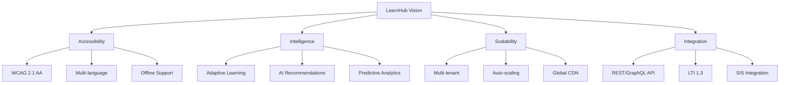
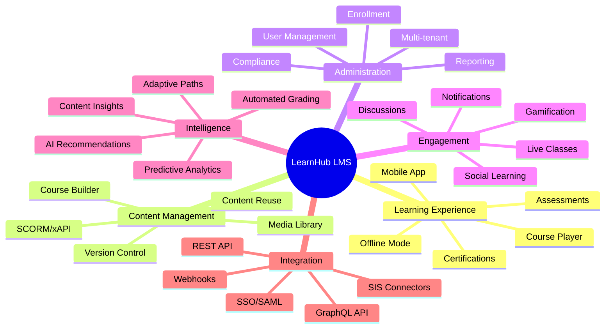
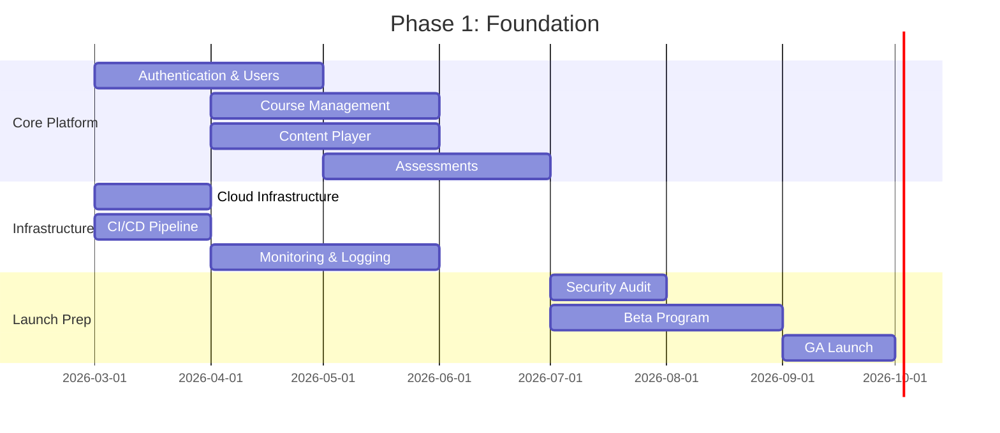

# Product Requirements Document (PRD)
# Learning Management System (LMS) Platform

**Document Version:** 1.0  
**Status:** Draft for Review  
**Last Updated:** February 19, 2026  
**Product Owner:** Product Management Team  
**Engineering Lead:** TBD  
**Design Lead:** TBD  

---

## Document Control

| Version | Date | Author | Changes |
|---------|------|--------|---------|
| 0.1 | 2026-02-01 | Product Team | Initial draft |
| 0.5 | 2026-02-10 | Product Team | Added user stories, metrics |
| 1.0 | 2026-02-19 | Product Team | Final review version |

---

## Table of Contents

1. [Executive Summary](#1-executive-summary)
2. [Product Vision](#2-product-vision)
3. [Target Users](#3-target-users)
4. [Problem Statements](#4-problem-statements)
5. [Core Features](#5-core-features)
6. [User Stories](#6-user-stories)
7. [Functional Requirements](#7-functional-requirements)
8. [Non-Functional Requirements](#8-non-functional-requirements)
9. [Success Metrics](#9-success-metrics)
10. [Go-to-Market Strategy](#10-go-to-market-strategy)
11. [Release Roadmap](#11-release-roadmap)
12. [Appendices](#12-appendices)

---

## 1. Executive Summary

### 1.1 Product Overview

**LearnHub LMS** is a next-generation Learning Management System designed to bridge the gap between enterprise-grade functionality and user-friendly simplicity. Our platform combines AI-powered personalization, modern UX, and transparent pricing to serve the underserved mid-market segment (500-10,000 users).

### 1.2 Business Opportunity

| Metric | Value |
|--------|-------|
| **Target Market Size** | $12.5B (mid-market LMS segment) |
| **Projected TAM** | $45.8B by 2030 |
| **Target Market Share** | 2% within 3 years |
| **Revenue Goal (Year 3)** | $50M ARR |

### 1.3 Key Differentiators

```mermaid
vennDiagram
    title "LearnHub Differentiation Strategy"
    circle "Enterprise Features"
    circle "Consumer UX"
    circle "AI-Powered"
    center "LearnHub"
```

1. **AI-First Architecture** - Adaptive learning, intelligent content recommendations, automated assessment
2. **Transparent Pricing** - No hidden fees, no surprise overages, clear tier structure
3. **Developer Experience** - Best-in-class API, webhooks, SDK, and documentation
4. **Modern UX** - Intuitive interface requiring minimal training
5. **Rapid Deployment** - Go live in days, not months

### 1.4 Success Criteria

| Criteria | Target | Timeline |
|----------|--------|----------|
| **Customer Acquisition** | 500 paying customers | 24 months |
| **User Base** | 500,000 active learners | 24 months |
| **Revenue** | $10M ARR | 24 months |
| **NPS Score** | 50+ | 12 months |
| **Uptime SLA** | 99.95% | Launch |

---

## 2. Product Vision

### 2.1 Vision Statement

> "To democratize access to world-class learning experiences by providing an intelligent, accessible, and scalable platform that empowers educators and engages learners."

### 2.2 Mission

Enable organizations of all sizes to deliver exceptional learning experiences through technology that adapts to learners, simplifies administration, and drives measurable outcomes.

### 2.3 Core Values

| Value | Description |
|-------|-------------|
| **Learner-Centric** | Every feature starts with the learner experience |
| **Accessibility First** | WCAG 2.1 AA compliance is non-negotiable |
| **Data Privacy** | User data is protected and never sold |
| **Continuous Innovation** | AI and ML capabilities evolve with the platform |
| **Transparency** | Clear pricing, open communication, honest roadmaps |

### 2.4 Strategic Pillars



---

## 3. Target Users

### 3.1 User Personas

#### Persona 1: Sarah - The Student

| Attribute | Details |
|-----------|---------|
| **Age** | 18-25 (traditional), 25-55 (non-traditional) |
| **Tech Savviness** | Moderate to High |
| **Goals** | Complete courses, earn credentials, advance career |
| **Pain Points** | Confusing interfaces, poor mobile experience, lack of engagement |
| **Usage Pattern** | Mobile-first, micro-learning sessions (15-30 min) |

**Quote:** *"I need to learn on my schedule, from my phone, without jumping through hoops."*

---

#### Persona 2: Marcus - The Instructor

| Attribute | Details |
|-----------|---------|
| **Role** | Professor, Corporate Trainer, Course Creator |
| **Tech Savviness** | Low to Moderate |
| **Goals** | Create engaging content, track student progress, reduce admin work |
| **Pain Points** | Complex course builders, limited analytics, poor support |
| **Usage Pattern** | Desktop-focused, batch content creation, regular grading |

**Quote:** *"I want to focus on teaching, not fighting with technology."*

---

#### Persona 3: Jennifer - The Administrator

| Attribute | Details |
|-----------|---------|
| **Role** | LMS Admin, IT Director, Learning Operations Manager |
| **Tech Savviness** | High |
| **Goals** | Ensure uptime, manage users, generate reports, control costs |
| **Pain Points** | Hidden fees, poor support, complex integrations, compliance concerns |
| **Usage Pattern** | Dashboard monitoring, user management, reporting cycles |

**Quote:** *"I need a platform that just works, with transparent costs and reliable support."*

---

#### Persona 4: David - The Executive

| Attribute | Details |
|-----------|---------|
| **Role** | CLO, VP of Learning, CEO (SMB) |
| **Tech Savviness** | Low to Moderate |
| **Goals** | ROI on learning investment, organizational skill development, compliance |
| **Pain Points** | Lack of actionable insights, difficulty measuring impact |
| **Usage Pattern** | Executive dashboards, quarterly reviews, strategic planning |

**Quote:** *"Show me how learning is driving business outcomes."*

---

### 3.2 Target Market Segments

| Segment | Description | Size | Priority |
|---------|-------------|------|----------|
| **Mid-Market Enterprise** | 500-10,000 employees | 50,000 companies | P0 |
| **Higher Education** | Community colleges, small universities | 3,000 institutions | P0 |
| **K-12 Districts** | Medium school districts | 5,000 districts | P1 |
| **Course Creators** | Professional instructors, consultants | 500,000+ individuals | P1 |
| **Government/Non-Profit** | Public sector, NGOs | 10,000+ organizations | P2 |

---

## 4. Problem Statements

### 4.1 Current Market Problems

| Problem | Affected Users | Impact |
|---------|----------------|--------|
| **Complex, outdated interfaces** | Students, Instructors | Low engagement, high support costs |
| **Expensive enterprise solutions** | SMBs, Mid-market | Priced out of quality LMS |
| **Limited AI capabilities** | All users | Missed personalization opportunities |
| **Poor mobile experiences** | Students | Reduced accessibility, lower completion |
| **Opaque pricing models** | Administrators | Budget uncertainty, sticker shock |
| **Difficult integrations** | IT Teams | Long deployment cycles, custom dev costs |
| **Limited analytics** | Executives | Cannot measure learning ROI |

### 4.2 Problem Validation

**Research Methodology:**
- 50+ customer interviews
- 500+ survey responses
- Competitive product analysis
- Support ticket analysis from competitors

**Key Findings:**
1. 73% of users cite "confusing interface" as top frustration
2. 68% of SMBs report being overcharged for unused features
3. 82% want AI-powered recommendations but only 15% have access
4. 91% expect full mobile functionality
5. 64% experienced unexpected price increases

---

## 5. Core Features

### 5.1 Feature Categories



### 5.2 Feature Prioritization Matrix

| Feature | User Value | Business Value | Complexity | Priority |
|---------|------------|----------------|------------|----------|
| **Course Player** | High | High | Medium | P0 |
| **Course Builder** | High | High | High | P0 |
| **User Management** | High | High | Low | P0 |
| **Assessments** | High | High | Medium | P0 |
| **AI Recommendations** | High | High | High | P0 |
| **Mobile Apps** | High | Medium | High | P1 |
| **Analytics Dashboard** | High | High | Medium | P1 |
| **Gamification** | Medium | Medium | Medium | P2 |
| **Social Learning** | Medium | Medium | High | P2 |
| **Live Classes** | Medium | Medium | High | P2 |
| **VR/AR Support** | Low | Low | Very High | P3 |
| **Blockchain Credentials** | Low | Medium | High | P3 |

---

### 5.3 Detailed Feature Specifications

#### 5.3.1 Course Player

**Description:** Modern, responsive course content delivery interface

**Requirements:**
- Support video, audio, text, interactive content
- Progress tracking and resume capability
- Note-taking and bookmarking
- Playback speed control (video)
- Keyboard navigation and screen reader support
- Offline content download (mobile)

**Acceptance Criteria:**
- [ ] Loads course content in < 2 seconds
- [ ] Supports 4K video playback
- [ ] WCAG 2.1 AA compliant
- [ ] Works on iOS 15+, Android 10+
- [ ] Progress syncs across devices

---

#### 5.3.2 Course Builder

**Description:** Intuitive drag-and-drop course creation interface

**Requirements:**
- Drag-and-drop content organization
- Rich text editor with media embedding
- Quiz and assessment builder
- Bulk content upload
- Template library
- Preview mode
- Version history

**Acceptance Criteria:**
- [ ] Create course in < 5 minutes (template)
- [ ] Upload 100+ files in single operation
- [ ] Auto-save every 30 seconds
- [ ] Support SCORM 1.2, 2004, xAPI import
- [ ] Real-time collaboration (multi-author)

---

#### 5.3.3 AI-Powered Recommendations

**Description:** Machine learning system for personalized learning paths

**Requirements:**
- Analyze learner behavior and performance
- Recommend next courses/modules
- Identify knowledge gaps
- Suggest remedial content
- Predict at-risk learners
- A/B test recommendation algorithms

**Acceptance Criteria:**
- [ ] Generate recommendations in < 500ms
- [ ] Improve course completion by 20%+
- [ ] Support cold-start for new users
- [ ] Explain recommendation rationale
- [ ] Allow manual override

---

#### 5.3.4 Analytics Dashboard

**Description:** Comprehensive reporting and insights platform

**Requirements:**
- Pre-built report templates
- Custom report builder
- Real-time data refresh
- Export to CSV, PDF, Excel
- Scheduled report delivery
- Role-based data access
- Data visualization library

**Acceptance Criteria:**
- [ ] Load dashboard in < 3 seconds
- [ ] Support 1M+ data points
- [ ] 50+ pre-built reports
- [ ] API access to all metrics
- [ ] GDPR-compliant data handling

---

## 6. User Stories

### 6.1 Student User Stories

| ID | As a... | I want to... | So that... | Priority | Acceptance Criteria |
|----|---------|--------------|------------|----------|---------------------|
| **S1** | Student | View my course dashboard | I can see all my enrolled courses and progress | P0 | Dashboard shows course cards with progress bars |
| **S2** | Student | Access courses on mobile | I can learn anywhere, anytime | P0 | Full course functionality on iOS/Android |
| **S3** | Student | Download content for offline | I can learn without internet | P1 | Video/text downloadable, syncs when online |
| **S4** | Student | Receive personalized recommendations | I discover relevant courses | P0 | AI suggests 3-5 courses based on history |
| **S5** | Student | Track my certifications | I know my credential status | P1 | Certificate dashboard with expiry alerts |
| **S6** | Student | Participate in discussions | I can learn from peers | P2 | Threaded discussions with notifications |
| **S7** | Student | Earn badges and rewards | I stay motivated | P2 | Gamification system with visible progress |
| **S8** | Student | Get help when stuck | I don't give up on courses | P1 | In-context help, AI tutor access |
| **S9** | Student | Set learning goals | I stay on track | P2 | Goal setting with progress tracking |
| **S10** | Student | Export my learning record | I have portable credentials | P3 | xAPI/CLR export functionality |

---

### 6.2 Instructor User Stories

| ID | As a... | I want to... | So that... | Priority | Acceptance Criteria |
|----|---------|--------------|------------|----------|---------------------|
| **I1** | Instructor | Create courses easily | I can focus on content, not tech | P0 | Drag-and-drop builder, templates |
| **I2** | Instructor | Upload bulk content | I can migrate existing materials | P0 | Batch upload 100+ files |
| **I3** | Instructor | Create quizzes and assessments | I can evaluate student learning | P0 | Multiple question types, auto-grading |
| **I4** | Instructor | View student progress | I can identify struggling students | P0 | Real-time progress dashboard |
| **I5** | Instructor | Grade assignments efficiently | I save time on evaluation | P1 | Rubric-based grading, bulk actions |
| **I6** | Instructor | Communicate with students | I can provide timely support | P1 | Announcements, messaging, notifications |
| **I7** | Instructor | Reuse content across courses | I don't duplicate work | P1 | Content library with tagging |
| **I8** | Instructor | Get course analytics | I can improve my teaching | P1 | Engagement metrics, assessment analysis |
| **I9** | Instructor | Co-author with colleagues | We can collaborate on courses | P2 | Real-time collaboration, version control |
| **I10** | Instructor | Protect my content | My IP is secure | P1 | DRM, download restrictions, watermarks |

---

### 6.3 Administrator User Stories

| ID | As a... | I want to... | So that... | Priority | Acceptance Criteria |
|----|---------|--------------|------------|----------|---------------------|
| **A1** | Admin | Manage users in bulk | I can onboard organizations quickly | P0 | CSV import, SSO provisioning |
| **A2** | Admin | Configure SSO/SAML | Users have seamless access | P0 | Support SAML 2.0, OIDC, LDAP |
| **A3** | Admin | Generate compliance reports | We meet regulatory requirements | P0 | Pre-built compliance templates |
| **A4** | Admin | Monitor system health | I can prevent issues | P0 | Real-time dashboard, alerts |
| **A5** | Admin | Manage subscriptions | I control costs | P0 | Usage tracking, billing portal |
| **A6** | Admin | Configure permissions | Access is properly controlled | P0 | RBAC with custom roles |
| **A7** | Admin | Integrate with existing systems | Data flows seamlessly | P1 | REST API, webhooks, SIS connectors |
| **A8** | Admin | Audit user activity | We have security visibility | P1 | Comprehensive audit logs |
| **A9** | Admin | Customize branding | Platform matches our identity | P1 | White-label, custom domain |
| **A10** | Admin | Backup and restore data | We're protected from data loss | P2 | Automated backups, point-in-time restore |

---

### 6.4 Executive User Stories

| ID | As a... | I want to... | So that... | Priority | Acceptance Criteria |
|----|---------|--------------|------------|----------|---------------------|
| **E1** | Executive | View learning ROI | I can justify LMS investment | P1 | Cost per learner, skill improvement metrics |
| **E2** | Executive | Track organizational skills | I know our capability gaps | P1 | Skills matrix, gap analysis |
| **E3** | Executive | Monitor compliance status | We avoid regulatory issues | P1 | Compliance dashboard, alerts |
| **E4** | Executive | Compare periods | I can see trends | P2 | Historical comparisons, trend lines |
| **E5** | Executive | Export executive reports | I can share with board/stakeholders | P2 | PDF/PPT export, scheduled delivery |

---

## 7. Functional Requirements

### 7.1 Authentication & Authorization

| ID | Requirement | Priority |
|----|-------------|----------|
| **FR-AUTH-001** | Support email/password authentication | P0 |
| **FR-AUTH-002** | Support SSO via SAML 2.0 | P0 |
| **FR-AUTH-003** | Support SSO via OIDC/OAuth 2.0 | P0 |
| **FR-AUTH-004** | Support LDAP/Active Directory integration | P1 |
| **FR-AUTH-005** | Implement MFA (TOTP, SMS, Email) | P1 |
| **FR-AUTH-006** | Support passwordless authentication | P2 |
| **FR-AUTH-007** | Session management with configurable timeout | P0 |
| **FR-AUTH-008** | Role-Based Access Control (RBAC) | P0 |
| **FR-AUTH-009** | Custom role creation | P1 |
| **FR-AUTH-010** | Permission inheritance | P1 |

---

### 7.2 User Management

| ID | Requirement | Priority |
|----|-------------|----------|
| **FR-USER-001** | Create, read, update, delete users | P0 |
| **FR-USER-002** | Bulk user import via CSV | P0 |
| **FR-USER-003** | Bulk user export | P1 |
| **FR-USER-004** | User groups and cohorts | P0 |
| **FR-USER-005** | Self-registration with approval workflow | P1 |
| **FR-USER-006** | User profile customization | P0 |
| **FR-USER-007** | Profile picture upload | P1 |
| **FR-USER-008** | User deactivation (soft delete) | P0 |
| **FR-USER-009** | GDPR data export/deletion | P0 |
| **FR-USER-010** | Automated user provisioning (SCIM) | P2 |

---

### 7.3 Course Management

| ID | Requirement | Priority |
|----|-------------|----------|
| **FR-CRS-001** | Create courses with metadata | P0 |
| **FR-CRS-002** | Organize content into modules/lessons | P0 |
| **FR-CRS-003** | Support multiple content types (video, text, quiz, etc.) | P0 |
| **FR-CRS-004** | Drag-and-drop content reordering | P0 |
| **FR-CRS-005** | Course templates | P1 |
| **FR-CRS-006** | Course cloning/duplication | P1 |
| **FR-CRS-007** | Course versioning | P2 |
| **FR-CRS-008** | Course archival | P1 |
| **FR-CRS-009** | Prerequisite configuration | P1 |
| **FR-CRS-010** | Learning path/curriculum creation | P1 |

---

### 7.4 Content Management

| ID | Requirement | Priority |
|----|-------------|----------|
| **FR-CNT-001** | Upload files (video, audio, documents) | P0 |
| **FR-CNT-002** | Video transcoding and streaming | P0 |
| **FR-CNT-003** | Content library with search | P0 |
| **FR-CNT-004** | Content tagging and categorization | P0 |
| **FR-CNT-005** | SCORM 1.2 and 2004 import | P0 |
| **FR-CNT-006** | xAPI (Tin Can) support | P1 |
| **FR-CNT-007** | AICC support | P2 |
| **FR-CNT-008** | Content reuse across courses | P1 |
| **FR-CNT-009** | Content preview before publishing | P0 |
| **FR-CNT-010** | DRM and content protection | P1 |

---

### 7.5 Assessment & Grading

| ID | Requirement | Priority |
|----|-------------|----------|
| **FR-ASM-001** | Multiple choice questions | P0 |
| **FR-ASM-002** | True/False questions | P0 |
| **FR-ASM-003** | Short answer questions | P0 |
| **FR-ASM-004** | Essay questions | P0 |
| **FR-ASM-005** | File upload assignments | P0 |
| **FR-ASM-006** | Auto-grading for objective questions | P0 |
| **FR-ASM-007** | Manual grading workflow | P0 |
| **FR-ASM-008** | Rubric-based grading | P1 |
| **FR-ASM-009** | Grade book with export | P0 |
| **FR-ASM-010** | Plagiarism detection integration | P2 |
| **FR-ASM-011** | Question banks | P1 |
| **FR-ASM-012** | Randomized question pools | P1 |
| **FR-ASM-013** | Timed assessments | P0 |
| **FR-ASM-014** | Proctoring integration | P2 |

---

### 7.6 Enrollment & Completion

| ID | Requirement | Priority |
|----|-------------|----------|
| **FR-ENR-001** | Manual enrollment | P0 |
| **FR-ENR-002** | Self-enrollment | P0 |
| **FR-ENR-003** | Bulk enrollment | P0 |
| **FR-ENR-004** | Enrollment rules/automation | P1 |
| **FR-ENR-005** | Waitlist management | P2 |
| **FR-ENR-006** | Course completion tracking | P0 |
| **FR-ENR-007** | Certificate generation | P0 |
| **FR-ENR-008** | Custom certificate templates | P1 |
| **FR-ENR-009** | Certificate verification | P1 |
| **FR-ENR-010** | Expiry and recertification | P1 |

---

### 7.7 Notifications & Communication

| ID | Requirement | Priority |
|----|-------------|----------|
| **FR-NOT-001** | Email notifications | P0 |
| **FR-NOT-002** | In-app notifications | P0 |
| **FR-NOT-003** | Push notifications (mobile) | P1 |
| **FR-NOT-004** | SMS notifications | P2 |
| **FR-NOT-005** | Notification preferences | P0 |
| **FR-NOT-006** | Course announcements | P0 |
| **FR-NOT-007** | Direct messaging | P1 |
| **FR-NOT-008** | Discussion forums | P2 |
| **FR-NOT-009** | @mentions | P2 |
| **FR-NOT-010** | Notification digest | P1 |

---

### 7.8 Reporting & Analytics

| ID | Requirement | Priority |
|----|-------------|----------|
| **FR-RPT-001** | Pre-built report templates | P0 |
| **FR-RPT-002** | Custom report builder | P1 |
| **FR-RPT-003** | Real-time dashboards | P0 |
| **FR-RPT-004** | Scheduled report delivery | P1 |
| **FR-RPT-005** | Export to CSV, PDF, Excel | P0 |
| **FR-RPT-006** | User activity reports | P0 |
| **FR-RPT-007** | Course completion reports | P0 |
| **FR-RPT-008** | Assessment performance reports | P0 |
| **FR-RPT-009** | Engagement analytics | P1 |
| **FR-RPT-010** | API access to analytics data | P1 |

---

### 7.9 Integration

| ID | Requirement | Priority |
|----|-------------|----------|
| **FR-INT-001** | REST API (comprehensive) | P0 |
| **FR-INT-002** | GraphQL API | P1 |
| **FR-INT-003** | Webhooks for events | P0 |
| **FR-INT-004** | LTI 1.3 support | P1 |
| **FR-INT-005** | Zoom integration | P1 |
| **FR-INT-006** | Microsoft Teams integration | P1 |
| **FR-INT-007** | Slack integration | P2 |
| **FR-INT-008** | Salesforce integration | P2 |
| **FR-INT-009** | HRIS connectors (Workday, BambooHR) | P2 |
| **FR-INT-010** | SIS connectors (PowerSchool, Infinite Campus) | P1 |

---

## 8. Non-Functional Requirements

### 8.1 Performance

| ID | Requirement | Target |
|----|-------------|--------|
| **NFR-PERF-001** | Page load time (P95) | < 2 seconds |
| **NFR-PERF-002** | API response time (P95) | < 200ms |
| **NFR-PERF-003** | Video start time | < 1 second |
| **NFR-PERF-004** | Search results | < 500ms |
| **NFR-PERF-005** | Dashboard load | < 3 seconds |
| **NFR-PERF-006** | Concurrent users supported | 100,000+ |
| **NFR-PERF-007** | API rate limit | 1,000 requests/minute |

---

### 8.2 Availability & Reliability

| ID | Requirement | Target |
|----|-------------|--------|
| **NFR-AVL-001** | Uptime SLA | 99.95% |
| **NFR-AVL-002** | Planned maintenance window | < 4 hours/month |
| **NFR-AVL-003** | RTO (Recovery Time Objective) | < 1 hour |
| **NFR-AVL-004** | RPO (Recovery Point Objective) | < 5 minutes |
| **NFR-AVL-005** | Multi-region failover | Automatic |
| **NFR-AVL-006** | Database backup frequency | Every 5 minutes |

---

### 8.3 Security

| ID | Requirement | Standard |
|----|-------------|----------|
| **NFR-SEC-001** | Data encryption at rest | AES-256 |
| **NFR-SEC-002** | Data encryption in transit | TLS 1.3 |
| **NFR-SEC-003** | Compliance | SOC 2 Type II |
| **NFR-SEC-004** | Compliance | GDPR |
| **NFR-SEC-005** | Compliance | FERPA |
| **NFR-SEC-006** | Compliance | CCPA |
| **NFR-SEC-007** | Penetration testing | Quarterly |
| **NFR-SEC-008** | Vulnerability scanning | Weekly |
| **NFR-SEC-009** | Security audit logging | All actions |
| **NFR-SEC-010** | Session timeout | Configurable (default 30 min) |

---

### 8.4 Scalability

| ID | Requirement | Target |
|----|-------------|--------|
| **NFR-SCL-001** | Users per tenant | 100,000+ |
| **NFR-SCL-002** | Total platform users | 10M+ |
| **NFR-SCL-003** | Courses per tenant | 10,000+ |
| **NFR-SCL-004** | Storage per tenant | 10TB+ |
| **NFR-SCL-005** | Video streaming bandwidth | Auto-scaling |
| **NFR-SCL-006** | API throughput | 10,000 RPS |
| **NFR-SCL-007** | Database connections | Auto-scaling |

---

### 8.5 Accessibility

| ID | Requirement | Standard |
|----|-------------|----------|
| **NFR-ACC-001** | Web accessibility | WCAG 2.1 AA |
| **NFR-ACC-002** | Mobile accessibility | WCAG 2.1 AA |
| **NFR-ACC-003** | Screen reader support | JAWS, NVDA, VoiceOver |
| **NFR-ACC-004** | Keyboard navigation | Full support |
| **NFR-ACC-005** | Color contrast | 4.5:1 minimum |
| **NFR-ACC-006** | Captions for video | Required |
| **NFR-ACC-007** | Transcripts for audio | Required |

---

### 8.6 Internationalization

| ID | Requirement | Target |
|----|-------------|--------|
| **NFR-I18N-001** | Supported languages (launch) | 10+ |
| **NFR-I18N-002** | Supported languages (Year 2) | 30+ |
| **NFR-I18N-003** | RTL language support | Arabic, Hebrew |
| **NFR-I18N-004** | Date/time localization | All regions |
| **NFR-I18N-005** | Currency support | Multi-currency |
| **NFR-I18N-006** | Timezone support | All timezones |

---

## 9. Success Metrics

### 9.1 Business Metrics

| Metric | Definition | Target (Year 1) | Target (Year 2) | Target (Year 3) |
|--------|------------|-----------------|-----------------|-----------------|
| **ARR** | Annual Recurring Revenue | $2M | $10M | $50M |
| **Customers** | Paying organizations | 100 | 300 | 500 |
| **End Users** | Active learners | 50,000 | 200,000 | 500,000 |
| **NRR** | Net Revenue Retention | 100% | 110% | 120% |
| **CAC** | Customer Acquisition Cost | $5,000 | $4,000 | $3,000 |
| **LTV** | Lifetime Value | $30,000 | $40,000 | $50,000 |
| **LTV:CAC** | Efficiency ratio | 6:1 | 10:1 | 15:1 |
| **Gross Margin** | Revenue - COGS | 70% | 75% | 80% |

---

### 9.2 Product Metrics

| Metric | Definition | Target |
|--------|------------|--------|
| **DAU/MAU** | Daily/Monthly Active Users ratio | > 40% |
| **Session Duration** | Average time per session | > 20 minutes |
| **Course Completion Rate** | % of enrolled users who complete | > 60% |
| **Feature Adoption** | % using key features | > 70% |
| **Time to First Value** | Signup to first course completion | < 24 hours |
| **Mobile Usage** | % of sessions on mobile | > 50% |
| **API Usage** | API calls per day | 10M+ |

---

### 9.3 Customer Success Metrics

| Metric | Definition | Target |
|--------|------------|--------|
| **NPS** | Net Promoter Score | 50+ |
| **CSAT** | Customer Satisfaction Score | 4.5/5 |
| **Churn Rate** | Monthly customer churn | < 2% |
| **Support Ticket Volume** | Tickets per 100 users | < 5/month |
| **First Response Time** | Support response time | < 2 hours |
| **Resolution Time** | Time to resolve tickets | < 24 hours |
| **Onboarding Completion** | % completing onboarding | > 80% |

---

### 9.4 Technical Metrics

| Metric | Definition | Target |
|--------|------------|--------|
| **Uptime** | Platform availability | 99.95% |
| **P95 Latency** | 95th percentile response time | < 200ms |
| **Error Rate** | % of requests with errors | < 0.1% |
| **Deployment Frequency** | Production deployments | Daily |
| **Change Failure Rate** | % of deployments causing issues | < 5% |
| **MTTR** | Mean Time to Recovery | < 1 hour |
| **Security Incidents** | Confirmed breaches | 0 |

---

### 9.5 Learning Effectiveness Metrics

| Metric | Definition | Target |
|--------|------------|--------|
| **Knowledge Retention** | Post-course assessment scores | > 80% |
| **Skill Application** | Self-reported skill usage | > 70% |
| **Learning Path Completion** | Multi-course path completion | > 50% |
| **Certification Pass Rate** | First-attempt pass rate | > 75% |
| **Engagement Score** | Composite engagement metric | > 70/100 |

---

## 10. Go-to-Market Strategy

### 10.1 Pricing Strategy

| Tier | Price | Target | Features |
|------|-------|--------|----------|
| **Free** | $0 | Individuals, Trials | Up to 50 users, basic features |
| **Starter** | $3/user/month | SMBs (50-500 users) | Core LMS, email support |
| **Professional** | $5/user/month | Mid-market (500-5,000) | Advanced features, priority support |
| **Enterprise** | Custom | Large orgs (5,000+) | Full features, dedicated support, SLA |
| **Creator** | $99/month | Individual instructors | Unlimited students, 0% transaction fee |

---

### 10.2 Distribution Channels

| Channel | Strategy | Investment |
|---------|----------|------------|
| **Self-Service** | Website signup, free tier | High |
| **Inside Sales** | Inbound lead conversion | Medium |
| **Field Sales** | Enterprise accounts | High |
| **Partners** | Resellers, integrators | Medium |
| **Marketplace** | Integration partnerships | Low |

---

### 10.3 Marketing Strategy

| Tactic | Description | Budget Allocation |
|--------|-------------|-------------------|
| **Content Marketing** | Blog, guides, comparisons | 25% |
| **SEO/SEM** | Organic and paid search | 20% |
| **Events** | Conferences, webinars | 20% |
| **Partner Marketing** | Co-marketing with integrations | 15% |
| **Customer Marketing** | Case studies, referrals | 10% |
| **Brand/PR** | Media relations, analyst relations | 10% |

---

## 11. Release Roadmap

### 11.1 Phase 1: Foundation (Months 1-6)



**Milestones:**
- M1: Core authentication and user management
- M2: Course creation and content upload
- M3: Course player and progress tracking
- M4: Assessment engine
- M5: Beta launch with design partners
- M6: General Availability

---

### 11.2 Phase 2: Growth (Months 7-12)

| Feature | Description | Target Date |
|---------|-------------|-------------|
| **Mobile Apps** | iOS and Android native apps | Month 8 |
| **AI Recommendations** | ML-powered course suggestions | Month 9 |
| **Analytics Dashboard** | Comprehensive reporting | Month 10 |
| **Integrations** | Zoom, Teams, Slack, HRIS | Month 11 |
| **Gamification** | Badges, points, leaderboards | Month 12 |

---

### 11.3 Phase 3: Scale (Months 13-18)

| Feature | Description | Target Date |
|---------|-------------|-------------|
| **Advanced AI** | Adaptive learning paths | Month 14 |
| **Social Learning** | Communities, peer learning | Month 15 |
| **Live Classes** | Integrated virtual classroom | Month 16 |
| **Marketplace** | Third-party content marketplace | Month 17 |
| **White-label** | Full branding customization | Month 18 |

---

### 11.4 Phase 4: Innovation (Months 19-24)

| Feature | Description | Target Date |
|---------|-------------|-------------|
| **VR/AR Support** | Immersive learning experiences | Month 20 |
| **Blockchain Credentials** | Verifiable digital credentials | Month 21 |
| **Voice Interface** | Alexa/Google Assistant integration | Month 22 |
| **Advanced Analytics** | Predictive insights, AI tutor | Month 24 |

---

## 12. Appendices

### 12.1 Glossary

| Term | Definition |
|------|------------|
| **LMS** | Learning Management System |
| **LXP** | Learning Experience Platform |
| **SCORM** | Sharable Content Object Reference Model |
| **xAPI** | Experience API (Tin Can) |
| **LTI** | Learning Tools Interoperability |
| **SIS** | Student Information System |
| **SSO** | Single Sign-On |
| **RBAC** | Role-Based Access Control |
| **ARR** | Annual Recurring Revenue |
| **NPS** | Net Promoter Score |
| **NRR** | Net Revenue Retention |
| **CAC** | Customer Acquisition Cost |
| **LTV** | Lifetime Value |
| **SLA** | Service Level Agreement |
| **RTO** | Recovery Time Objective |
| **RPO** | Recovery Point Objective |
| **WCAG** | Web Content Accessibility Guidelines |
| **SOC 2** | Service Organization Control 2 |
| **GDPR** | General Data Protection Regulation |
| **FERPA** | Family Educational Rights and Privacy Act |

---

### 12.2 References

1. Competitive Analysis Document (docs/COMPETITIVE_ANALYSIS.md)
2. Architecture Document (docs/ARCHITECTURE.md)
3. Market Research Report (internal)
4. Customer Interview Summaries (internal)
5. Technical Feasibility Study (internal)

---

### 12.3 Approval Sign-off

| Role | Name | Signature | Date |
|------|------|-----------|------|
| **Product Owner** | | | |
| **Engineering Lead** | | | |
| **Design Lead** | | | |
| **Security Lead** | | | |
| **Executive Sponsor** | | | |

---

*This document is confidential and intended for internal use only.*

**Document End**
